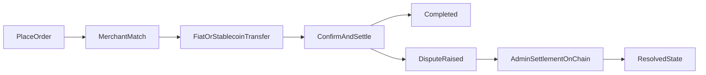

## 3.1 Actors

The protocol involves several key participants working together to enable trustless peer-to-peer transactions.

**Buyers and Sellers** are everyday users who initiate on-ramp or off-ramp orders. They interact with the protocol through client applications using integrated wallets and transacting without surrendering custody of their funds.

**Merchants**, also known as liquidity peers, serve as the counterparties who mediate liquidity between stablecoins and fiat currencies. These are carefully vetted participants who maintain sufficient liquidity and have established strong reputations through the Proof-of-Credibility system.

**Protocol Contracts** are the on-chain smart contracts that orchestrate the entire order lifecycle. They handle order queuing, matching based on credibility scores, state verification, and final settlement outcomes. These contracts operate transparently on Base L2.

**Proof Verifiers** are responsible for validating ZK and TLS-backed proofs submitted during transactions or disputes. Verification can occur on-chain for compact claims, or through designated off-chain attesters for more complex rail-specific statements, with results posted back on-chain.

**Governance** encompasses the mechanisms through which protocol parameters, upgrades, and treasury decisions are made. The current implementation is admin/multisig operated, with a planned transition to broader token-holder governance as the protocol matures.

## 3.2 Components

- **Base L2 smart contracts** for order lifecycle, matching, dispute windows, parameter registry, and fee routing.
- **Reputation registry** implementing Proof-of-Credibility (inputs, scoring, decay).
- **Oracle adapter** for reference pricing and safeguards (median/TWAP, fallbacks, circuit breakers).
- **Client SDKs** and reference apps (e.g., Coins.me) that speak the protocol.

## 3.3 High-Level Flow

1. **Placing Orders:** A user clicks "Buy USDC" (or "Sell USDC") and enters amount. The app provides an integrated wallet for the transaction.
2. **Order Matching:** A list of carefully vetted merchants is queued via Proof-of-Credibility. A fiat payment address is shared over the smart contract, encrypted with the user's keys; for off-ramps, a Base USDC address is presented.
3. **Fiat/Stablecoin Transfer:** The payer performs the transfer on the designated rail.
4. **Confirmation/Settlement:** Within minutes, settlement succeeds once the counter-proof condition is met (e.g., merchant confirms receipt or buyer submits transfer proof). Wallet balances update accordingly.
5. **Dispute Window:** If a party contests, they submit evidence (including ZK/TLS-backed proofs where available) that a payment or action occurred (or did not). In the live implementation, authorized admins settle disputed orders on-chain according to protocol fault rules and dispute windows.



## 3.4 On-Ramp Flow

```
┌─────────────────────────────────────────────────────────────────────────┐
│                         ON-RAMP FLOW (Fiat → USDC)                      │
├─────────────────────────────────────────────────────────────────────────┤
│                                                                         │
│   ┌──────────┐         ┌──────────────┐         ┌──────────────┐        │
│   │   USER   │         │   PROTOCOL   │         │   MERCHANT   │        │
│   └────┬─────┘         └──────┬───────┘         └──────┬───────┘        │
│        │                      │                        │                │
│        │  1. Open BUY order   │                        │                │
│        │  (amount + rail)     │                        │                │
│        │─────────────────────►│                        │                │
│        │                      │                        │                │
│        │                      │  2. Match via PoC      │                │
│        │                      │  (credibility score)   │                │
│        │                      │───────────────────────►│                │
│        │                      │                        │                │
│        │  3. Receive fiat     │                        │                │
│        │  payment address     │                        │                │
│        │◄─────────────────────│                        │                │
│        │  (encrypted)         │                        │                │
│        │                      │                        │                │
│        │  4. Transfer fiat    │                        │                │
│        │  via bank/UPI/PIX    │                        │                │
│        │──────────────────────────────────────────────►│                │
│        │                      │                        │                │
│        │                      │  5. Merchant confirms  │                │
│        │                      │  OR user submits       │                │
│        │                      │  ZK payment proof      │                │
│        │                      │◄───────────────────────│                │
│        │                      │                        │                │
│        │  6. USDC released    │                        │                │
│        │  to user wallet      │                        │                │
│        │◄─────────────────────│                        │                │
│        │                      │                        │                │
│   ┌────▼─────┐         ┌──────▼───────┐         ┌──────▼───────┐        │
│   │  USDC    │         │    FEES      │         │   BONDS      │        │
│   │ RECEIVED │         │  COLLECTED   │         │  UNLOCKED    │        │
│   └──────────┘         └──────────────┘         └──────────────┘        │
│                                                                         │
└─────────────────────────────────────────────────────────────────────────┘
```

## 3.5 Off-Ramp Flow

```
┌─────────────────────────────────────────────────────────────────────────┐
│                        OFF-RAMP FLOW (USDC → Fiat)                      │
├─────────────────────────────────────────────────────────────────────────┤
│                                                                         │
│   ┌──────────┐         ┌──────────────┐         ┌──────────────┐        │
│   │   USER   │         │   PROTOCOL   │         │   MERCHANT   │        │
│   └────┬─────┘         └──────┬───────┘         └──────┬───────┘        │
│        │                      │                        │                │
│        │  1. Open SELL order  │                        │                │
│        │  + lock USDC         │                        │                │
│        │─────────────────────►│                        │                │
│        │                      │                        │                │
│        │                      │  2. Match via PoC      │                │
│        │                      │  + merchant posts bond │                │
│        │                      │───────────────────────►│                │
│        │                      │                        │                │
│        │  3. Share fiat       │                        │                │
│        │  receiving address   │                        │                │
│        │─────────────────────►│                        │                │
│        │  (encrypted)         │                        │                │
│        │                      │                        │                │
│        │                      │  4. Merchant sends     │                │
│        │  Fiat received       │  fiat payment          │                │
│        │◄──────────────────────────────────────────────│                │
│        │                      │                        │                │
│        │                      │  5. Merchant submits   │                │
│        │                      │  ZK payment proof      │                │
│        │                      │◄───────────────────────│                │
│        │                      │                        │                │
│        │                      │  6. USDC released      │                │
│        │                      │  to merchant           │                │
│        │                      │───────────────────────►│                │
│        │                      │                        │                │
│   ┌────▼─────┐         ┌──────▼───────┐         ┌──────▼───────┐        │
│   │  FIAT    │         │    FEES      │         │    USDC      │        │
│   │ RECEIVED │         │  COLLECTED   │         │  RECEIVED    │        │
│   └──────────┘         └──────────────┘         └──────────────┘        │
│                                                                         │
└─────────────────────────────────────────────────────────────────────────┘
```

## 3.6 Key Considerations

- The **merchant** serves the function of mediating liquidity for the transactions.
- The **onus of sharing ZK proof** always rests on the merchant (for off-ramps) or can be provided by either party.
- **ZK-proof performs trustless KYC** for the user without exposing personal data.
- **ZK-proofs serve as verifiable evidence** in disputes. In the current system, outcomes are executed via on-chain admin settlement; broader verifier and governance-driven resolution remains roadmap.
- **Reclaim Protocol** securely encrypts all in-transit data carried by the ZK proof.
- All proof creation, storage, and transmission is handled via the **TLS 1.2/1.3 specification**.

---