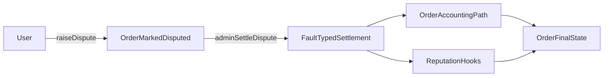

A user raises a dispute for an order if timing and state conditions are met. The order is marked disputed, merchant dispute state is updated, and an admin settles with a fault type (`USER`, `MERCHANT`, or `BANK`). Settlement triggers order/accounting paths and RP updates via hooks.

- Dispute windows differ by order type.
- A dispute cannot be raised twice.
- Settlement requires admin authorization.

*Jury-based escalation tiers (T1 resolver, T2 jury, T3 token-governance) and SLA-based auto-escalation are planned for a future release.*

---