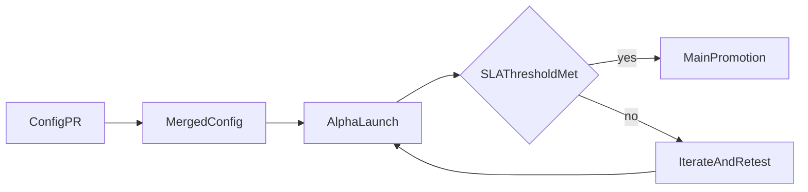

Adding a new country today requires manual coordination with no standard process. Local knowledge is siloed. The expansion framework solves this by making country configs open-source and promotion criteria transparent.

- Open-source country YAML configs capturing local payment-rail knowledge
- Alpha environment where new currencies launch with explicit "no SLA guaranteed" framing
- Public health metrics (settlement rate, dispute rate, volume) that gate promotion to the main app

The bottleneck for geographic expansion is local knowledge. Open-source configs let anyone with local expertise propose a new currency. Public SLA gates ensure quality without requiring HQ to manually evaluate every market.

---