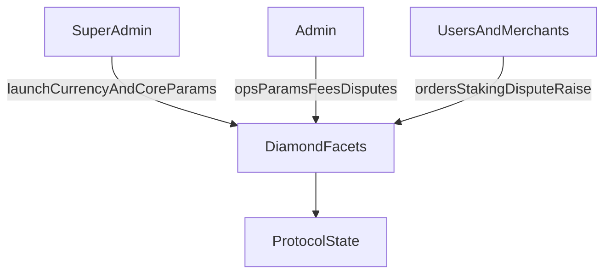

The protocol defines three governance scopes.

**Super admin** launches currencies, sets core risk/limit parameters, and manages critical protocol configuration.

**Admin** manages operational parameters including spread, merchant fee percentages, disputes, and merchant/payment-channel actions.

**Merchant and user** scope covers order lifecycle, staking/registration flows, and dispute initiation according to contract rules.

---