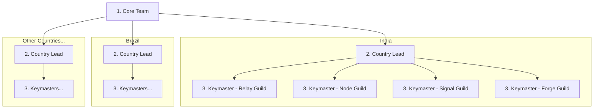

| Level | Role | Code Name |
|-------|------|-----------|
| Core Team | Protocol founders and leads | "Core Team" |
| Country Lead | Manages all tracks in a country | "Country Lead" |
| Coordinator | Track coordinators | "Keymaster" |
| Contributor | Community ambassadors | "Cipher" |

Each "Keymaster" manages up to 5 "Ciphers".

## Country Lead Responsibilities

Each "Country Lead" manages all four tracks in their country.

| Code Name | Scope |
|-----------|-------|
| **Relay Guild** | Country Discord/Telegram channels |
| **Node Guild** | Colleges and local events |
| **Signal Guild** | Regional social media (local language content) |
| **Forge Guild** | Translations, local dev community |

---