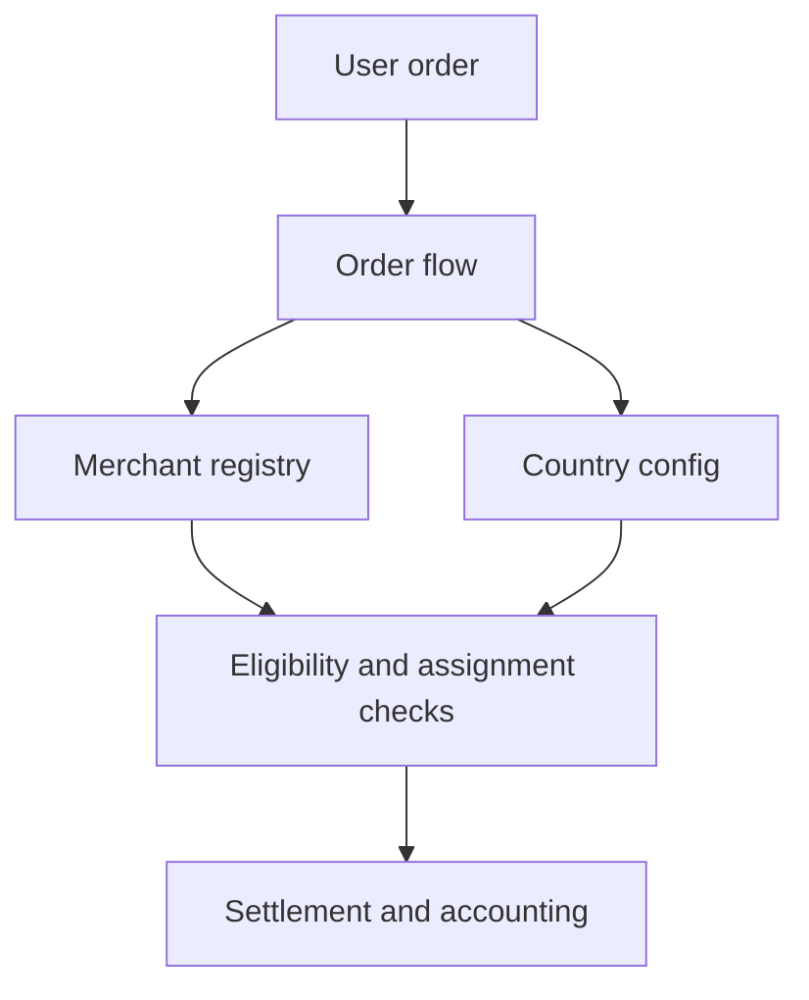

A Circle of Trust is a community-backed collective of merchants operated by a Circle Admin. Each Circle functions as a semi-autonomous unit within the protocol, managing its own merchant network while adhering to shared on-chain protocol rules.

Circles organize merchants into accountable groups, enable community oversight through staking and delegation, and distribute risk through tiered insurance pools.

The merchant registry is the operational core that Circles wrap. All merchant operations are on-chain and role-gated.

*First-class Circle entities with dedicated lifecycle, Circle Admin roles with explicit stake requirements, and Circle-scoped merchant grouping are planned for a future release.*

---