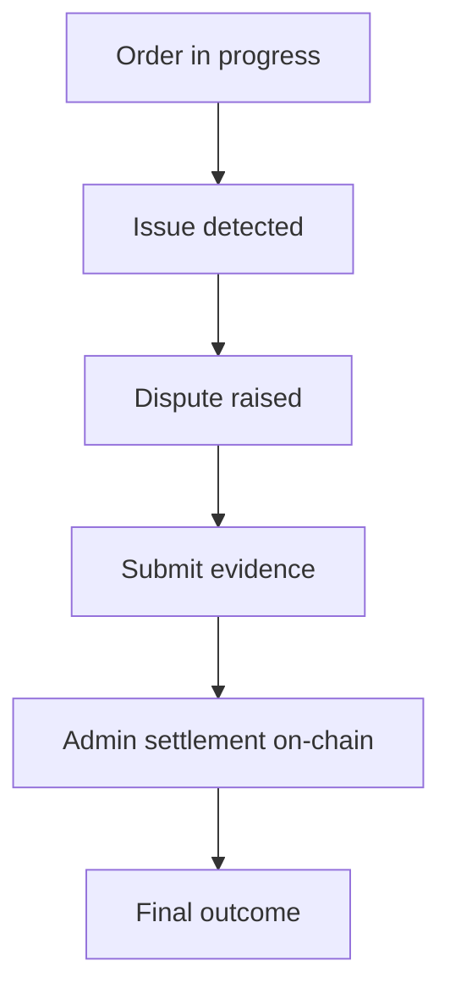

If a dispute is raised, follow these steps.

1. Review order context and timestamps.
2. Submit supporting evidence in-app.
3. Follow settlement updates and resulting order state transitions.

Disputes are settled on-chain by authorized admins under protocol fault rules and dispute windows.

*Jury-based escalation tiers and governance-vote finality for disputes are planned for a future release.*

---