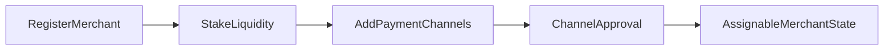

## Step 1 Register and Stake

1. Register as merchant for an active currency.
2. Stake required settlement liquidity.
3. Confirm your merchant profile and operational status.

## Step 2 Add Payment Channels

1. Add payment channels for your supported rails.
2. Wait for required approval states.
3. Keep approved channels active and up to date.

---