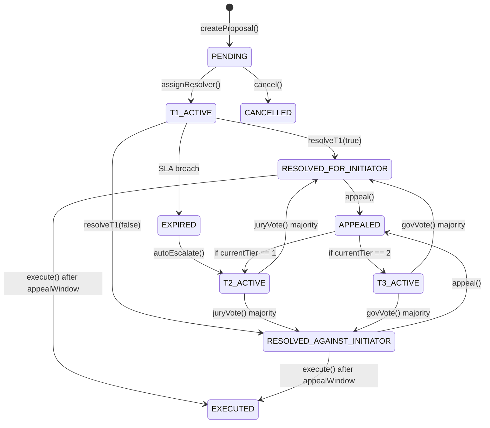

*Design rationale: spc.3, spc.7*

## 3.1 Proposal Struct

| Field | Type | Description |
|-------|------|-------------|
| proposalId | uint256 | Unique identifier (keccak256 hash) |
| proposalType | enum | `ORDER_DISPUTE` | `INSURANCE_CLAIM` | `AUDIT_REQUEST` | `PARAMETER_CHANGE` |
| proposalSubType | bytes32 | `DISPUTE_SELL` | `DISPUTE_BUY` | `CLAIM_ABSCONDING` | `CLAIM_MERCHANT_FAULT` | `CLAIM_EXTERNAL` |
| initiator | address | The address of the initiator of the proposal |
| target | bytes32 | The target of the proposal (orderId or claimRef) |
| amount | uint256 | The amount of the proposal |
| evidenceHash | bytes32 | The IPFS hash of the supporting evidence |
| currentTier | uint8 | The current tier of the proposal (1, 2, or 3) |
| state | ProposalState | The state of the proposal |
| tierDeadline | uint256 | The deadline for the current tier |
| escrowedFee | uint256 | The fee reserved from the escrow source |
| resolution | enum | `FOR_INITIATOR` | `AGAINST_INITIATOR` |

## 3.2 Proposal States

## 3.3 Proposal Types & SubTypes

| Type | Initiator | Target | Fee Source |
|------|-----------|--------|------------|
| `ORDER_DISPUTE` | User only | orderId | Order escrow |
| `INSURANCE_CLAIM` | Merchant only | claimRef | Merchant stake |
| `AUDIT_REQUEST` | Any (1000 RP) | CoT adminAddress | Proposer bond (100 $P2P) |
| `PARAMETER_CHANGE` | Any (10000 RP) | parameterKey | Proposer bond (500 $P2P) |

**Dispute SubTypes:**

| SubType | Collateral | RP Multiplier |
|---------|------------|---------------|
| `DISPUTE_SELL` | Yes (USDC escrowed) | 1x |
| `DISPUTE_BUY` | No (fiat off-chain) | 10x/5x/3.3x (T1/T2/T3, spc.4.2) |

**Claim SubTypes:**

| SubType | Coverage | Source |
|---------|----------|--------|
| `CLAIM_ABSCONDING` | 75% | CAIP |
| `CLAIM_MERCHANT_FAULT` | 100% | CAIP + CALR |
| `CLAIM_EXTERNAL` | 100% | CAIP + CALR |

## 3.4 Core Functions

| Function | Access |
|----------|--------|
| `createProposal()` | User (disputes) / Merchant (claims) |
| `resolveT1()` | Assigned CoT Admin |
| `appeal()` | Losing party (within appealWindow) |
| `castJuryVote()` | Selected jurors only |
| `castGovernanceVote()` | All $P2P stakers |
| `execute()` | Anyone (after appealWindow) |
| `cancel()` | Initiator (before resolution) |

---