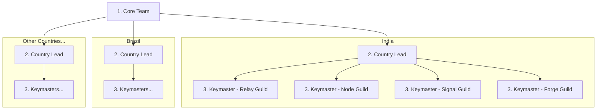

# P2P Foundation Ambassador Program "The Liberation Network"

| | |
|---|---|
| **Name** | P2P Foundation Ambassador Program |
| **Code Name** | "The Liberation Network" |

## Cypherpunk 2.0 Manifesto

Privacy is necessary for an open society in the electronic age. We cannot expect governments, corporations, or other large, faceless organizations to grant us privacy out of their beneficence.

We the cypherpunks are dedicated to building anonymous systems. We are defending our privacy with cryptography, with anonymous mail forwarding systems, with digital signatures, and with electronic money.

**"The Liberation Network" exists to:**
- Enable financial sovereignty without surveillance
- Build peer-to-peer systems that resist censorship
- Empower individuals to transact freely across borders
- Spread the tools and knowledge of financial liberation

Participation requires no identity. Contribution requires no permission. Impact is measured by action, not affiliation.

---

## Hierarchy

| Level | Role | Code Name |
|-------|------|-----------|
| Core Team | Protocol founders and leads | "Core Team" |
| Country Lead | Manages all tracks in a country | "Country Lead" |
| Coordinator | Track coordinators | "Keymaster" |
| Contributor | Community ambassadors | "Cipher" |

### Structure



Each "Keymaster" manages up to 5 "Ciphers".

### Operators (Enumerated)

| # | Role | Scope | Appointed By |
|---|------|-------|--------------|
| 1 | "Core Team" | Program-wide | - |
| 2 | "Country Lead" | All tracks in their country | "Core Team" |
| 3 | "Keymaster" | Track within country | "Country Lead" |
| 4 | "Cipher" | Per Keymaster scope | "Keymaster" |

### Country Lead Responsibilities

Each "Country Lead" manages all four tracks in their country:

| Code Name | "Keymaster" Scope |
|-----------|-------------------|
| **Relay Guild** | Country Discord/Telegram channels |
| **Node Guild** | Colleges and local events |
| **Signal Guild** | Regional social media (local language content) |
| **Forge Guild** | Translations, local dev community |

*Note: Countries, channels, and tracks are added by "Core Team" as needed.*

---

## Four Tracks

| Code Name | Actual Name | Focus | SLA Metric |
|-----------|-------------|-------|------------|
| **Relay Guild** | Community | Discord/Telegram moderation, user support | Users/merchants onboarded |
| **Node Guild** | Campus | Colleges, local events, meetups | Users/merchants onboarded |
| **Signal Guild** | Media | Social media content, regional accounts | Impressions |
| **Forge Guild** | Dev/Docs | Translations, docs, dev community | Commits/pages |

All tracks operate at the country level, managed by "Country Leads".

---

## Actions by Role

### "Core Team"

| Action | Description |
|--------|-------------|
| Define countries | Add new countries and appoint Country Leads as needed |
| Appoint "Country Leads" | Select country leads for active regions |
| Set quarterly targets | Define SLA thresholds per track per country |
| Approve all funds | All grants, salaries, and payments |
| Monthly sync | Review program performance with Country Leads |
| Spotlight announcements | Recognize top "Ciphers" |
| Disburse monthly rewards | Process salary payments for "Keymasters" and "Ciphers" |

### "Country Lead"

| Action | Description |
|--------|-------------|
| Appoint "Keymasters" | Select "Keymasters" for all tracks in their country |
| Conduct inductions | Run induction sessions on 1st and 3rd Sunday (1-2 hours) |
| Review "Keymaster" updates | Check weekly updates from "Keymasters", flag missed updates |
| Weekly sync with "Keymasters" | Async thread with all track "Keymasters" |
| Monthly reporting | Submit country activity report to "Core Team" |
| Nominate "Cipher" of the Month | Recognize top contributors in their country |
| Raise fund requests | Submit salary and grant requests to "Core Team" |
| Manage country channels | Add/remove Discord channels for their country |

### "Keymaster" (Coordinator)

| Action | Description |
|--------|-------------|
| Open jobs | Post job openings for "Ciphers" to apply |
| Define "Cipher" roles | Create roles based on track needs |
| Conduct interviews | Interview candidates for open positions |
| Review job applications | Select "Ciphers" for open positions |
| Assign roles | Match "Ciphers" to jobs based on skills |
| Review "Cipher" updates | Check weekly updates, flag missed updates |
| Content review | Review submissions from "Ciphers" |
| Raise fund requests | Submit salary and grant requests to "Country Lead" |
| Escalate issues | Flag problems to "Country Lead" |

### "Cipher" (Contributor)

Roles defined by their "Keymaster" based on track needs.

| Track | Example Roles | SLA Metric |
|-------|---------------|------------|
| Relay Guild | Community Mod, Onboarder, Support | Users/merchants onboarded |
| Node Guild | Event Host, Campus Lead, Meetup Organizer | Users/merchants onboarded |
| Signal Guild | Content Creator, Amplifier, Memer | Impressions |
| Forge Guild | Translator, Tester, Doc Writer | Commits/pages |

"Keymasters" create and assign roles to "Ciphers" within their scope.

---

## Selection

| Role | Scope | Selected By |
|------|-------|-------------|
| "Country Lead" | All tracks in country | "Core Team" |
| "Keymaster" | Track within country | "Country Lead" |
| "Cipher" | Per Keymaster | "Keymaster" (500 XP + Induction + Interview) |

### Becoming a Candidate

**Requirements:** None

Anyone can become a Candidate by joining Discord. No XP requirement to join as a Candidate.

### Candidate → "Cipher" Requirements

1. Minimum 500 XP
2. Complete mandatory induction session
3. Apply for an open role posted by a "Keymaster"
4. Pass interview with "Keymaster"

**Induction Sessions:**
- Conducted by "Country Leads" via Discord
- Held on 1st and 3rd Sunday of every month (1-2 hours)
- Covers program expectations, track responsibilities, and SLAs
- Candidates must attend before applying for roles

**Process:**
1. Join Discord as a Candidate (no XP required)
2. Earn 500 XP through app usage and social activity
3. Attend next scheduled induction session (bi-weekly, conducted by "Country Lead")
4. Browse open roles posted by "Keymasters" in your track/country
5. Apply for a role via Discord ticket
6. "Keymaster" reviews application and conducts interview
7. Upon approval, become a "Cipher" with role and channel access

---

## Weekly Updates & Offboarding

### Weekly Update Requirement

All "Ciphers" and "Keymasters" must submit weekly updates to maintain active status.

| Role | Reports To | Deadline |
|------|------------|----------|
| "Cipher" | "Keymaster" | Saturday 00:00 – Sunday 24:00 |
| "Keymaster" | "Country Lead" | Saturday 00:00 – Sunday 24:00 |
| "Country Lead" | "Core Team" | Saturday 00:00 – Sunday 24:00 |

**Update Format:**
```
Weekly Update - [Name] - [Week of MM/DD]
- What I did this week:
- Blockers:
- Plan for next week:
```

*All times in UTC. Updates must be submitted between Saturday 00:00 and Sunday 24:00 each week.*

### Auto-Offboarding

Missing updates triggers automatic offboarding:

| Missed Updates | Action |
|----------------|--------|
| 1 consecutive | Warning DM sent automatically |
| 2 consecutive | Role removed, moved to @Alumni |

**Process:**
1. Miss Week 1 update → Bot sends warning DM
2. Miss Week 2 update → Role automatically removed
3. Member moved to @Alumni role (can rejoin through normal process)

**Reinstatement:**
- @Alumni members can re-apply through normal Candidate → Cipher process
- Previous experience noted but no automatic reinstatement

*This applies equally to "Ciphers" and "Keymasters".*

---

## Discord Structure

```
THE LIBERATION NETWORK
├── #liberation-hub
├── #liberation-announcements
├── #hall-of-fame
│
├── CANDIDATES
│   ├── #candidates-chat
│   └── #link-wallet
│
├── ONBOARDING
│   ├── #apply-cipher
│   └── #open-roles
│
├── WEEKLY UPDATES
│   ├── #cipher-updates
│   └── #keymaster-updates
│
├── RELAY GUILD (Community)
│   ├── #relay-guild-india
│   ├── #relay-guild-brazil
│   └── #relay-guild-[country]
│
├── NODE GUILD (Campus)
│   ├── #node-guild-india
│   ├── #node-guild-brazil
│   └── #node-guild-[country]
│
├── SIGNAL GUILD (Media)
│   ├── #signal-guild-india
│   ├── #signal-guild-brazil
│   └── #signal-guild-[country]
│
├── FORGE GUILD (Dev/Docs)
│   ├── #forge-guild-india
│   ├── #forge-guild-brazil
│   └── #forge-guild-[country]
│
└── KEYMASTER ZONE
    ├── #keymaster-leads
    ├── #keymaster-sync
    └── #keymaster-review
```

**Code Names:**
| Code Name | Actual Name |
|-----------|-------------|
| Liberation Network | P2P Foundation Ambassador Program |
| Relay Guild | Community Track (Discord/Telegram) |
| Node Guild | Campus Track (Colleges/Events) |
| Signal Guild | Media Track (Social Media) |
| Forge Guild | Dev/Docs Track (Translations/Dev) |
| Keymaster | Coordinator |
| Cipher | Contributor |

*All Discord naming uses code names first (e.g., #relay-guild-india, #signal-guild-brazil).*

---

## Remuneration

| Role | Monthly Salary |
|------|----------------|
| "Keymaster" (Coordinator) | $200 |
| "Cipher" (Contributor) | Up to $100 (based on job assigned) |

**Contributor of the Month:** $500 × 3 = $1,500 monthly prize pool

All payments are made directly to your P2P wallet.

### Monthly Budget (4 Countries, 4 Tracks each)

| Item | Count | Rate | Total |
|------|-------|------|-------|
| **Per Country (4 countries)** | | | |
| Relay Guild "Keymaster" | 4 | $200 | $800 |
| Node Guild "Keymaster" | 4 | $200 | $800 |
| Signal Guild "Keymaster" | 4 | $200 | $800 |
| Forge Guild "Keymaster" | 4 | $200 | $800 |
| **Subtotal Keymasters** | **16** | | **$3,200** |
| **Ciphers** | | | |
| All tracks (16 × 5) | 80 | Up to $100 | **$8,000** (max) |
| **Monthly Spotlight** | 3 | $500 | **$1,500** |
| **TOTAL MONTHLY SPEND** | | | **$12,700** (max) |

### Fund Approval Flow

```
"Keymaster" raises request → "Country Lead" reviews → "Core Team" approves → Disbursement
```

All tracks follow the same flow through their "Country Lead".

### Grants

| Type | Amount | Approved By |
|------|--------|-------------|
| All grants | Any amount | "Core Team" |

**Recognition:**
- Monthly "Cipher" Spotlight
- Hall of Fame
- Official account amplification
- Conference tickets and travel support

---

## Principles

- **Anonymous-first:** No doxxing required at any level
- **Country-led:** Each country manages all tracks locally through "Country Leads"
- **Human selection:** "Country Leads" and "Keymasters" evaluate, not algorithms
- **Internal criteria:** On-chain activity reviewed privately
- **Sustainable ratio:** 1 "Keymaster" per 5 "Ciphers" max
- **Centralized funds:** All payments approved by "Core Team"
- **Track-based SLAs:** Impressions, commits, or onboarding
- **Cypherpunk ethos:** Privacy, decentralization, financial sovereignty

