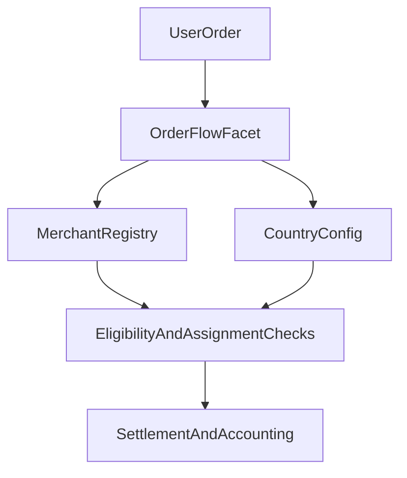

# Circles of Trust

## What is a Circle of Trust

A Circle of Trust is a community-backed collective of merchants operated by a Circle Admin. Each Circle functions as a semi-autonomous unit within the protocol, managing its own merchant network while adhering to shared on-chain protocol rules.

Circles organize merchants into accountable groups, enable community oversight through staking and delegation, and distribute risk through tiered insurance pools. The merchant registry was shipped first because it solves the immediate problem of matching users with vetted, staked liquidity providers. Circles add community-driven oversight, insurance layering, and delegation economics on top of this foundation.

---

## Merchant Lifecycle

Merchants register with a supported currency, stake settlement liquidity, and add payment channels tied to active country configs. They can request unstaking, withdraw accrued fees, and toggle online/offline status to participate in assignment queues.

All merchant operations are on-chain and role-gated. The merchant registry is the operational core that Circles wrap.

*First-class Circle entities with dedicated lifecycle, Circle Admin roles with explicit stake requirements, and Circle-scoped merchant grouping are planned for a future release.*

---

## Payment Channels and Country Controls

Policy is governed at the currency/country layer.

- Supported currencies can be activated or deactivated.
- Payment-channel configs are created, updated, activated, and deactivated.
- Monthly volume controls and thresholds are enforced by config.
- Merchant minimum stake and fee percentages are set per currency.

This creates a jurisdiction-aware operating model. When Circle entities ship, they inherit these per-country controls rather than rebuilding them.

---

## Order Assignment

Order assignment is constrained by merchant and payment-channel checks.

- Online/offline state
- Blacklist, dispute, and unstake-request status
- Ongoing-order capacity checks
- Payment-channel active/approved status
- Daily and monthly volume checks
- Fiat and stake-backed liquidity thresholds

Assignment is deterministic and on-chain. The checks are layered so that a single failing condition removes a merchant from the candidate pool without affecting others. This design scales to Circles. When Circle-level eligibility checks are added, they compose on top of the existing merchant-level gates.

---

## Disputes

Users raise disputes within defined time windows. An admin settles with a fault type, triggering order accounting updates, merchant state changes, and RP hooks.

*Jury-based escalation tiers and governance-vote finality for disputes are planned for a future release. The base dispute lifecycle will remain unchanged.*

---

## Delegation and Revenue Sharing

Token holders stake $P2P on Circles to attest to merchant trustworthiness and earn a share of the Circle's transaction revenue. Revenue is split based on working capital ratio with a merchant premium. Only delegation to $P2P-denominated Circles grants governance voting rights.

*The full delegation UI and Circle-level reward routing mechanics are planned for a future release.*

---

## Insurance

Each Circle includes insurance pools to protect participants.

**CAIP (Circle Admin Insurance Pool).** First-line coverage funded by a percentage of Circle volume plus slashed stakes.

**CALR (Circle Admin Locked Rewards).** A portion of admin earnings locked as a rolling buffer. Makes collusion economically irrational.

**PIP (Protocol Insurance Pool).** Backstop for systemic failures or depleted lower-tier pools.

Claims draw from pools in strict priority order. CAIP first, then CALR, then PIP.

*Circle-native insurance pools with programmable slash/reward logic and claim workflows are planned for a future release.*

---

## Guides

For step-by-step usage and operations, see the following.

- [`User Guide`](/user-guide) for BUY/SELL/PAY flows, order states, disputes, and FAQs
- [`Merchant Guide`](/merchant-guide) for registration, channels, order handling, disputes, and operations

---

## Contract References

- `facets/MerchantOnboardFacet.sol`
- `facets/MerchantRegistryFacet.sol`
- `facets/OrderFlowFacet.sol`
- `facets/OrderFlowHelper.sol`
- `facets/OrderProcessorFacet.sol`
- `facets/CountryFacet.sol`
- `storages/MerchantRegistryStorage.sol`
- `storages/CountryStorage.sol`
- `storages/OrderProcessorStorage.sol`
- `libraries/MerchantRegistryLib.sol`
