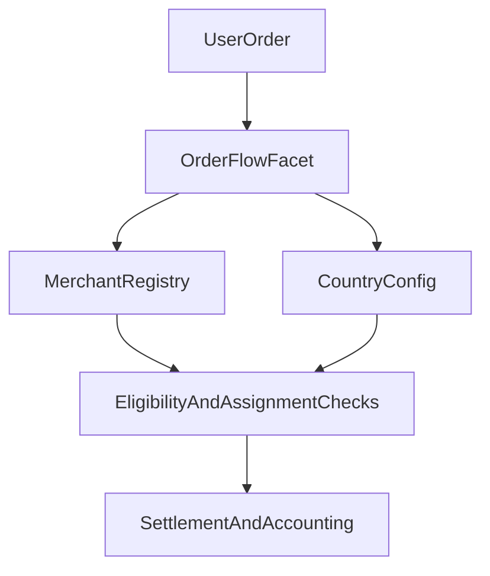
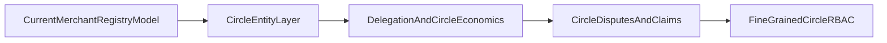

# Circles of Trust

## Implementation Status

### Implemented On-Chain Now

- Merchant-centric liquidity network with currency-scoped pools.
- Merchant registration, staking, payment-channel lifecycle, blacklist state, and online/offline routing controls.
- Country/currency-level policy controls (supported currencies, payment-channel configs, monthly limits).
- User-to-merchant order assignment with on-chain eligibility checks and per-channel risk constraints.
- Admin-settled disputes and reputation-linked penalties/rewards.

### Roadmap / Proposed Architecture

- First-class Circle entities with Circle Admin staking/delegation.
- Circle-native insurance pools and Circle-level revenue splits.
- Circle-specific RBAC and community jury-based escalation.

---

## What Exists Today (Merchant Registry Model)

The protocol runs on a **merchant registry + payment-channel** model today. The full Circle smart-contract model described in roadmap materials is a separate, planned layer.

This is deliberate. The merchant registry was shipped first because it solves the immediate problem of matching users with vetted, staked liquidity providers without requiring the full Circle governance and delegation stack. Circles add community-driven oversight, insurance layering, and delegation economics on top of this foundation. Building the registry first means the Circle layer inherits a battle-tested order flow and dispute system rather than inventing both simultaneously.

### 1) Merchant Lifecycle

Current merchant operations include the following.

- Register with a supported currency.
- Stake protocol settlement liquidity (USDT in current contracts).
- Add and maintain payment channels tied to active country payment-channel configs.
- Request/approve/cancel unstake flows and fee withdrawal flows.
- Toggle online/offline status and participate in assignment queues when eligible.

All on-chain, all role-gated. The merchant registry is the operational core that Circles will wrap.

### 2) Payment-Channel and Country Controls

Policy is governed at the currency/country layer.

- Supported currencies can be activated/deactivated.
- Payment-channel configs are created/updated/activated/deactivated.
- Monthly volume controls and thresholds are enforced by config.
- Merchant minimum stake and fee percentages are set per currency.

This creates a jurisdiction-aware operating model. When Circles ship, they inherit these per-country controls rather than rebuilding them.

### 3) Assignment, Eligibility, and Risk Gating

Order assignment is constrained by merchant and payment-channel checks.

- Online/offline state.
- Blacklist/dispute/unstake-request status.
- Ongoing-order capacity checks.
- Payment-channel active/approved status.
- Daily and monthly volume checks.
- Fiat and stake-backed liquidity thresholds.

Assignment is deterministic and on-chain. The checks are layered so that a single failing condition (e.g., disputed status, insufficient liquidity) removes a merchant from the candidate pool without affecting others. This design scales to Circles. When Circle-level eligibility checks are added, they compose on top of the existing merchant-level gates.

### 4) Disputes and Operational Integrity

Dispute handling in the live contracts is user-raised and admin-settled, with explicit time windows and order-state requirements.

Dispute settlement triggers the following updates.

- Merchant dispute flags are updated.
- Order accounting and merchant/user outcomes are executed.
- RP hooks are invoked where applicable.

This works today. The Circle roadmap adds jury and governance escalation tiers on top of it, but the base dispute lifecycle does not need to change.

### 5) Operational Guides

For step-by-step usage and operations, see the following guides.

- [`User Guide`](/user-guide) (BUY/SELL/PAY flows, order states, disputes, FAQs)
- [`Merchant Guide`](/merchant-guide) (registration, channels, order handling, disputes, operations, FAQs)

---

## Contract Surfaces (Current)

Representative implementation contracts.

- `facets/MerchantOnboardFacet.sol`
- `facets/MerchantRegistryFacet.sol`
- `facets/OrderFlowFacet.sol`
- `facets/OrderFlowHelper.sol`
- `facets/OrderProcessorFacet.sol`
- `facets/CountryFacet.sol`

Supporting storage/libraries.

- `storages/MerchantRegistryStorage.sol`
- `storages/CountryStorage.sol`
- `storages/OrderProcessorStorage.sol`
- `libraries/MerchantRegistryLib.sol`

---

## Roadmap (Not Yet Implemented On-Chain In This Repo)

The following should be read as target architecture.

### A) Circle Entity Layer

- Create one or more Circle objects with dedicated lifecycle/state.
- Circle Admin role with explicit stake and operational responsibilities.
- Circle-scoped merchant grouping and policy controls.

### B) Delegation and Circle Economics

- Public delegation to Circle Admins.
- Circle-level reward routing and lock mechanics.
- Circle-linked insurance funding and slash pathways.

### C) Tiered Circle Dispute / Claims Operations

- Escalation ladders (admin -> jury -> governance) as a Circle-native process.
- Insurance claim workflows routed by Circle-level risk pools.

### D) Fine-Grained Circle RBAC

- Explicit on-chain permission maps per Circle role and operation.
- Delegated ops with revocation and auditable policy boundaries.

---

## Integration Guidance

For production integrations, use merchant-registry and order/dispute facets as canonical. Circle-specific design is roadmap until corresponding contracts are deployed.
