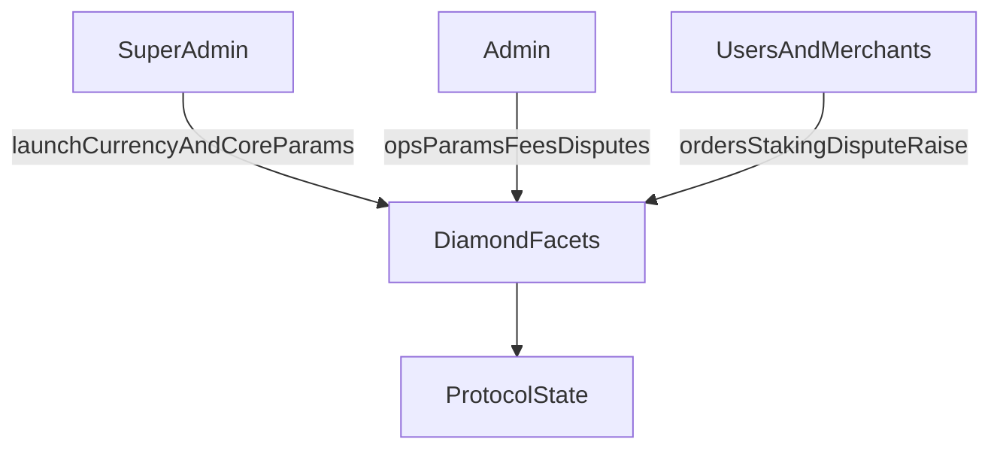
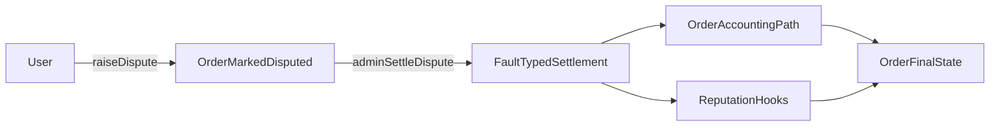
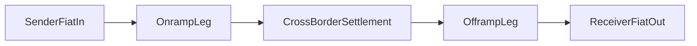
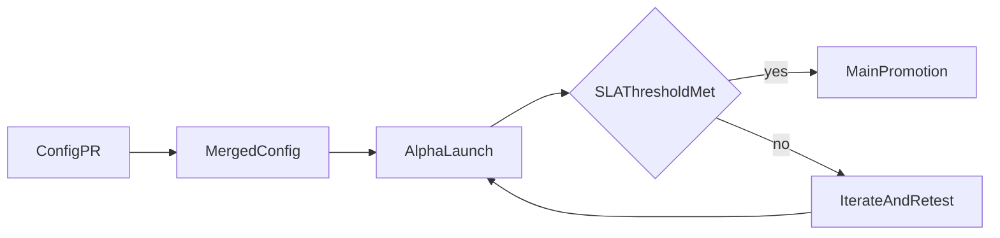

# For Builders

## Start Here

This page covers what builders need to integrate with, extend, or contribute to the P2P Protocol. It includes the protocol's technical governance model, contract architecture, and the highest-priority product expansion tracks.

**Quick links to key sections.**

- [Roles and permissions](/for-builders/roles-and-permissions)
- [Protocol parameters](/for-builders/protocol-parameters)
- [Disputes](/for-builders/disputes)
- [Reputation](/for-builders/reputation)
- [Contract references](/for-builders/contract-references)
- [Remittance expansion](/for-builders/fiat-to-fiat-remittance)
- [Currency expansion](/for-builders/global-currency-expansion)
- [FAQ](/for-builders/faq)

Also see [`/whitepaper`](/whitepaper/abstract) for protocol design and [`/for-investors`](/for-investors/start-here) for token governance and economics.

---

## Roles and Permissions

The protocol defines three governance scopes.

**Super admin** launches currencies, sets core risk/limit parameters, and manages critical protocol configuration.

**Admin** manages operational parameters including spread, merchant fee percentages, disputes, and merchant/payment-channel actions.

**Merchant and user** scope covers order lifecycle, staking/registration flows, and dispute initiation according to contract rules.

---

## Protocol Parameters

Protocol behavior is heavily parameterized rather than hardcoded because markets differ. A spread that works for INR/USDC on UPI rails would be wrong for BRL/USDC on PIX. Parameterization lets the protocol adapt per-currency without redeploying contracts.

**Pricing and spread.** Base spread and price bump by currency, adjusted for local liquidity conditions.

**Risk limits.** Min stake, volume caps, RP-per-USDT limits, and max tx limits. These gate how much risk the protocol takes per merchant and per user.

**Fee controls.** Merchant fee percentage and small-order fixed fees, tuned to make micro-transactions viable without subsidizing them.

**Operational controls.** Currency and payment-channel activation lifecycles.

---

## Disputes

A user raises a dispute for an order if timing and state conditions are met. The order is marked disputed, merchant dispute state is updated, and an admin settles with a fault type (`USER`, `MERCHANT`, or `BANK`). Settlement triggers order/accounting paths and RP updates via hooks.

- Dispute windows differ by order type.
- A dispute cannot be raised twice.
- Settlement requires admin authorization.

*Jury-based escalation tiers (T1 resolver, T2 jury, T3 token-governance) and SLA-based auto-escalation are planned for a future release.*

---

## Reputation

Reputation Points (RP) control who can do what on the protocol. RP directly governs transaction limits, dispute outcomes, and reward eligibility.

- Volume-driven RP growth rewards consistent participation.
- Dispute losses impose RP penalties that reduce future capacity.
- Verification signals (Aadhaar, social, passport) gate reward claims without requiring raw PII on-chain.

When token governance activates, RP and token voting become complementary. Tokens govern rules and reputation governs access.

---

## Contract References

- `facets/CountryFacet.sol` (currency and payment-channel config governance)
- `facets/P2pConfigFacet.sol` (pricing, spread, admin configuration)
- `facets/OrderProcessorFacet.sol` (disputes, limits, thresholds)
- `facets/MerchantRegistryFacet.sol` and `facets/MerchantOnboardFacet.sol` (merchant controls, fees, stake/unstake)
- `facets/OrderFlowFacet.sol` and `facets/OrderFlowHelper.sol` (order lifecycle, matching, settlement)
- `ReputationManager.sol` (RP hooks, reward/verification gating)
- `storages/MerchantRegistryStorage.sol`, `storages/CountryStorage.sol`, `storages/OrderProcessorStorage.sol`
- `libraries/MerchantRegistryLib.sol`

---

## Fiat-to-Fiat Remittance

The protocol already settles fiat-to-stablecoin and stablecoin-to-fiat independently. Remittance chains these two legs together atomically. The sender pays fiat in Country A, the receiver gets fiat in Country B, and the stablecoin hop in the middle is invisible to both.

Onramp, offramp, dispute, and matching rails all exist. The key insight is that remittance is purely a composition problem built from existing primitives. No new trust assumptions are needed.

**What's new for builders.**

- A linked order type that atomically connects onramp and offramp legs
- An escrow contract holding stablecoin between legs (failure on one side refunds the other)
- A receiver claim flow for recipients who don't already have accounts
- Cross-currency quote display and transparent fee breakdown

---

## Global Currency Expansion

Adding a new country today requires manual coordination with no standard process. Local knowledge is siloed. The expansion framework solves this by making country configs open-source and promotion criteria transparent.

- Open-source country YAML configs capturing local payment-rail knowledge
- Alpha environment where new currencies launch with explicit "no SLA guaranteed" framing
- Public health metrics (settlement rate, dispute rate, volume) that gate promotion to the main app

The bottleneck for geographic expansion is local knowledge. Open-source configs let anyone with local expertise propose a new currency. Public SLA gates ensure quality without requiring HQ to manually evaluate every market.

---

## Rollout Sequence

**Phase A.** Ship config standards, alpha lifecycle, and operational dashboards.

**Phase B.** Launch single high-priority remittance corridor with linked-order + escrow path.

**Phase C.** Expand corridors and currencies using measured SLA gates. Improve receiver claim UX and automation layers.

---

## FAQ

### Where are the contract ABIs?

Contract references are listed in the [Contract References](#contract-references) section. Source code is available under the terms described in the protocol's licensing documentation.

### Can I add a new country or currency?

The currency expansion framework uses open-source YAML configs. Anyone with local payment-rail knowledge can propose a new currency via PR.

### How do disputes work at the contract level?

Users call `raiseDispute` on `OrderProcessorFacet`. Admins settle via `adminSettleDispute` with a fault type. Settlement triggers accounting and RP hooks. See [Disputes](#disputes) for the full flow.

### What is the Diamond architecture?

The protocol uses EIP-2535 Diamond Standard. Functionality is split across facets that share storage, enabling modular upgrades without redeploying the full contract.

### How does RP integrate with order flow?

RP hooks are whitelisted in the `ReputationManager`. Order volume updates, dispute penalties, and verification-gated rewards all flow through these hooks. See [Reputation](#reputation).

### Where does governance detail live for token holders?

Token-holder governance (voting model, quorum, progressive decentralization) is documented in [`/for-investors`](/for-investors/start-here).
