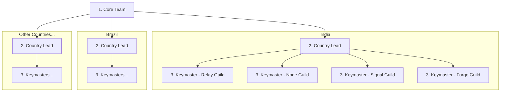

# For Community

## Start Here

The P2P Foundation Ambassador Program ("The Liberation Network") is a community-driven network that spreads financial sovereignty tools across emerging markets. It operates through country-level teams organized into four specialized tracks.

**Quick links to key sections.**

- [Manifesto](#cypherpunk-20-manifesto)
- [Hierarchy and roles](#hierarchy)
- [Four tracks](#four-tracks)
- [How to join](#how-to-join)
- [Weekly updates and offboarding](#weekly-updates-and-offboarding)
- [Remuneration](#remuneration)
- [FAQ](#faq)

Also see [`/whitepaper`](/whitepaper) for protocol context and [`/for-investors`](/for-investors) for the token thesis.

---

## Cypherpunk 2.0 Manifesto

Privacy is necessary for an open society in the electronic age. We cannot expect governments, corporations, or other large, faceless organizations to grant us privacy out of their beneficence.

We the cypherpunks are dedicated to building anonymous systems. We are defending our privacy with cryptography, with anonymous mail forwarding systems, with digital signatures, and with electronic money.

**"The Liberation Network" exists to enable the following.**

- Financial sovereignty without surveillance
- Peer-to-peer systems that resist censorship
- Individuals transacting freely across borders
- Spreading the tools and knowledge of financial liberation

Participation requires no identity. Contribution requires no permission. Impact is measured by action, not affiliation.

---

## Hierarchy

| Level | Role | Code Name |
|-------|------|-----------|
| Core Team | Protocol founders and leads | "Core Team" |
| Country Lead | Manages all tracks in a country | "Country Lead" |
| Coordinator | Track coordinators | "Keymaster" |
| Contributor | Community ambassadors | "Cipher" |



Each "Keymaster" manages up to 5 "Ciphers".

### Country Lead Responsibilities

Each "Country Lead" manages all four tracks in their country.

| Code Name | Scope |
|-----------|-------|
| **Relay Guild** | Country Discord/Telegram channels |
| **Node Guild** | Colleges and local events |
| **Signal Guild** | Regional social media (local language content) |
| **Forge Guild** | Translations, local dev community |

---

## Four Tracks

| Code Name | Focus | SLA Metric |
|-----------|-------|------------|
| **Relay Guild** | Discord/Telegram moderation, user support | Users/merchants onboarded |
| **Node Guild** | Colleges, local events, meetups | Users/merchants onboarded |
| **Signal Guild** | Social media content, regional accounts | Impressions |
| **Forge Guild** | Translations, docs, dev community | Commits/pages |

All tracks operate at the country level, managed by "Country Leads".

---

## How to Join

**Becoming a Candidate.** Anyone can become a Candidate by joining Discord. No XP requirement.

**Candidate to "Cipher" requirements.**

1. Earn minimum 500 XP through app usage and social activity
2. Attend a mandatory induction session (held on 1st and 3rd Sunday of every month, conducted by "Country Lead")
3. Browse open roles posted by "Keymasters" in your track/country
4. Apply via Discord ticket
5. Pass interview with "Keymaster"
6. Upon approval, become a "Cipher" with role and channel access

---

## Weekly Updates and Offboarding

All "Ciphers" and "Keymasters" must submit weekly updates.

| Role | Reports To | Deadline |
|------|------------|----------|
| "Cipher" | "Keymaster" | Saturday 00:00 to Sunday 24:00 UTC |
| "Keymaster" | "Country Lead" | Saturday 00:00 to Sunday 24:00 UTC |
| "Country Lead" | "Core Team" | Saturday 00:00 to Sunday 24:00 UTC |

**Auto-offboarding.** Missing 1 consecutive update triggers a warning DM. Missing 2 consecutive updates results in role removal and move to @Alumni. Alumni can re-apply through the normal process.

---

## Remuneration

| Role | Monthly Salary |
|------|----------------|
| "Keymaster" | $200 |
| "Cipher" | Up to $100 (based on job assigned) |

**Monthly Spotlight.** $500 x 3 = $1,500 monthly prize pool.

All payments made directly to your P2P wallet.

| Item | Count | Rate | Total |
|------|-------|------|-------|
| Keymasters (4 countries x 4 tracks) | 16 | $200 | $3,200 |
| Ciphers (16 x 5) | 80 | Up to $100 | $8,000 (max) |
| Monthly Spotlight | 3 | $500 | $1,500 |
| **Total monthly spend** | | | **$12,700 (max)** |

**Fund approval flow.** "Keymaster" raises request, "Country Lead" reviews, "Core Team" approves, disbursement.

---

## Discord Structure

```
THE LIBERATION NETWORK
├── #liberation-hub
├── #liberation-announcements
├── #hall-of-fame
├── CANDIDATES (#candidates-chat, #link-wallet)
├── ONBOARDING (#apply-cipher, #open-roles)
├── WEEKLY UPDATES (#cipher-updates, #keymaster-updates)
├── RELAY GUILD (#relay-guild-india, #relay-guild-brazil, ...)
├── NODE GUILD (#node-guild-india, #node-guild-brazil, ...)
├── SIGNAL GUILD (#signal-guild-india, #signal-guild-brazil, ...)
├── FORGE GUILD (#forge-guild-india, #forge-guild-brazil, ...)
└── KEYMASTER ZONE (#keymaster-leads, #keymaster-sync, #keymaster-review)
```

---

## Principles

- **Anonymous-first.** No doxxing required at any level
- **Country-led.** Each country manages all tracks locally
- **Human selection.** "Country Leads" and "Keymasters" evaluate, not algorithms
- **Sustainable ratio.** 1 "Keymaster" per 5 "Ciphers" max
- **Cypherpunk ethos.** Privacy, decentralization, financial sovereignty

---

## FAQ

### Do I need to reveal my identity to participate?

No. The program is anonymous-first at every level.

### What is XP and how do I earn it?

XP is earned through app usage and social activity. You need 500 XP to be eligible for a "Cipher" role.

### What happens if I miss a weekly update?

One missed update triggers a warning. Two consecutive missed updates result in automatic role removal. You can re-apply through the normal process.

### Can I participate from any country?

You can join Discord from anywhere. Active tracks depend on which countries have appointed Country Leads.

### How are payments made?

All payments go directly to your P2P wallet.
