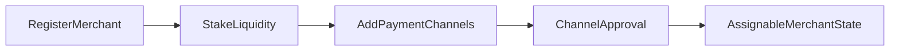
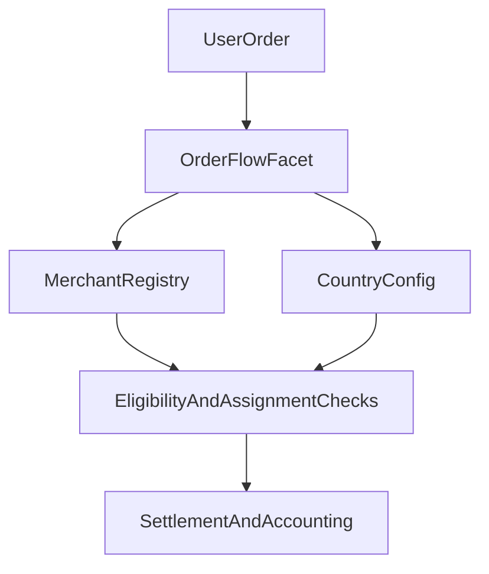
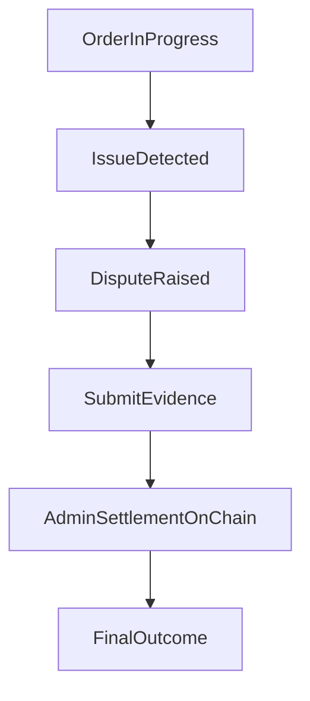

# For Merchants

## Start Here

This guide covers everything merchants need to operate on P2P Protocol, from registration through order handling and Circles of Trust.

**Quick links to key sections.**

- [Merchant readiness](#merchant-readiness)
- [Setup flow](#merchant-setup-flow)
- [Handling orders](#handling-orders)
- [Operational controls](#operational-controls)
- [Circles of Trust](#circles-of-trust)
- [Payment channels and country controls](#payment-channels-and-country-controls)
- [Order assignment](#order-assignment)
- [Disputes](#disputes)
- [Delegation and revenue sharing](#delegation-and-revenue-sharing)
- [Insurance](#insurance)
- [Troubleshooting](#troubleshooting)
- [FAQ](#faq)

Also see [`/for-users`](/for-users) to understand user-side expectations and [`/whitepaper`](/whitepaper) for protocol context.

---

## Merchant Readiness

Before operating, ensure you have the following.

- A wallet connected through a supported client/admin interface.
- Required settlement liquidity for supported currency operations.
- Active payment rails/accounts you can operationally maintain.

---

## Merchant Setup Flow

### Step 1 Register and Stake

1. Register as merchant for an active currency.
2. Stake required settlement liquidity.
3. Confirm your merchant profile and operational status.

### Step 2 Add Payment Channels

1. Add payment channels for your supported rails.
2. Wait for required approval states.
3. Keep approved channels active and up to date.

---

## Handling Orders

### Accepting Orders

1. Monitor assigned orders.
2. Accept orders promptly.
3. Follow the settlement steps by order type.

### Completing Orders

- Confirm payment actions as required by the flow.
- Ensure finalization steps are completed in-app.
- Keep records/evidence for dispute scenarios.

---

## Operational Controls

As a merchant, you should routinely perform the following.

- Keep channels active only when you can service them.
- Maintain sufficient liquidity for expected order load.
- Monitor order states and ongoing-order constraints.
- Withdraw accrued fees via supported flow.
- Use unstake/request flows when reducing or exiting activity.

---

## Circles of Trust

A Circle of Trust is a community-backed collective of merchants operated by a Circle Admin. Each Circle functions as a semi-autonomous unit within the protocol, managing its own merchant network while adhering to shared on-chain protocol rules.

Circles organize merchants into accountable groups, enable community oversight through staking and delegation, and distribute risk through tiered insurance pools.

The merchant registry is the operational core that Circles wrap. All merchant operations are on-chain and role-gated.

*First-class Circle entities with dedicated lifecycle, Circle Admin roles with explicit stake requirements, and Circle-scoped merchant grouping are planned for a future release.*

---

## Payment Channels and Country Controls

Policy is governed at the currency/country layer.

- Supported currencies can be activated or deactivated.
- Payment-channel configs are created, updated, activated, and deactivated.
- Monthly volume controls and thresholds are enforced by config.
- Merchant minimum stake and fee percentages are set per currency.

This creates a jurisdiction-aware operating model.

---

## Order Assignment

Order assignment is constrained by merchant and payment-channel checks.

- Online/offline state
- Blacklist, dispute, and unstake-request status
- Ongoing-order capacity checks
- Payment-channel active/approved status
- Daily and monthly volume checks
- Fiat and stake-backed liquidity thresholds

Assignment is deterministic and on-chain. The checks are layered so that a single failing condition removes a merchant from the candidate pool without affecting others.

---

## Disputes

If a dispute is raised, follow these steps.

1. Review order context and timestamps.
2. Submit supporting evidence in-app (including ZK/TLS-backed proofs where available).
3. Follow settlement updates and resulting order state transitions.

Disputes are settled on-chain by authorized admins under protocol fault rules and dispute windows.

*Jury-based escalation tiers and governance-vote finality for disputes are planned for a future release.*

---

## Delegation and Revenue Sharing

Token holders stake $P2P on Circles to attest to merchant trustworthiness and earn a share of the Circle's transaction revenue. Revenue is split based on working capital ratio with a merchant premium. Only delegation to $P2P-denominated Circles grants governance voting rights.

*The full delegation UI and Circle-level reward routing mechanics are planned for a future release.*

---

## Insurance

Each Circle includes insurance pools to protect participants.

**CAIP (Circle Admin Insurance Pool).** First-line coverage funded by a percentage of Circle volume plus slashed stakes.

**CALR (Circle Admin Locked Rewards).** A portion of admin earnings locked as a rolling buffer.

**PIP (Protocol Insurance Pool).** Backstop for systemic failures or depleted lower-tier pools.

Claims draw from pools in strict priority order. CAIP first, then CALR, then PIP.

*Circle-native insurance pools with programmable slash/reward logic and claim workflows are planned for a future release.*

---

## Risk and Reliability Practices

- Respond quickly to assigned orders.
- Keep channel metadata and payment details accurate.
- Avoid operating channels when unavailable.
- Preserve evidence trails for contested payments.
- Treat cancellations and disputes as quality signals to improve operations.

---

## Troubleshooting

### Not getting assigned orders

- Confirm you are online and channels are approved/active.
- Confirm operational availability and liquidity sufficiency.

### Orders frequently cancelled

- Review response speed and settlement completion discipline.
- Ensure payment channel details and balances are current.

### Unable to complete payout or settlement path

- Re-check channel readiness and app prompts.
- Escalate using supported admin/ops process if needed.

### Fee withdrawal not available

- Confirm you have accrued withdrawable fees and no blocking state.
- Retry through supported merchant operations interface.

---

## FAQ

### Do I need to know internal scoring criteria?

No. Operate based on app-visible status, liquidity requirements, and channel approval states.

### Can I run multiple payment channels?

Yes, each subject to its own approval and volume limits.

### What happens if a user disputes my order?

Submit evidence promptly. The dispute resolves on-chain based on fault determination and the evidence provided.

### Can I pause order assignments?

Yes. Toggle online/offline status or deactivate channels when you can't service orders.

### What is a Circle of Trust and how does it affect me?

A Circle is a community-backed group of merchants. Circle Admins oversee operations, and community members can delegate tokens to your Circle to earn yield. As a merchant, your primary interaction is through the merchant registry and payment channels that Circles wrap.

### How do I earn revenue?

Merchants earn a share of transaction volume through the protocol's fee distribution model. You can withdraw accrued fees through the supported merchant operations flow. See [`/for-investors`](/for-investors) for the full fee distribution breakdown.

### Where are the exact numeric thresholds?

Thresholds visible in your deployment/client are operational. Internal scoring criteria are not publicly documented.
