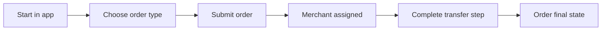

# For Users

## Start Here

This guide covers everything you need to buy, sell, or pay with stablecoins using P2P Protocol.

**Quick links to key sections.**

- [Before you start](#before-you-start)
- [Order types](#order-types)
- [How to place an order](#how-to-place-an-order)
- [What to do by order type](#what-to-do-by-order-type)
- [Understanding order states](#understanding-order-states)
- [Disputes and evidence](#disputes-and-evidence)
- [Troubleshooting](#troubleshooting)
- [FAQ](#faq)

Also see [`/for-merchants`](/for-merchants) to understand counterparty actions and [`/whitepaper`](/whitepaper) for protocol context.

---

## Before You Start

**What you need.**

- An account on a P2P Protocol client app (wallet is provided in-app via thirdweb integration).
- Access to supported payment rails in your region.
- Stablecoin balance for SELL/PAY flows.

**Basic safety checks.**

- Confirm you are on the official app domain before signing in.
- Verify order details (amount, currency, recipient) before submission.
- Do not share your login credentials or account recovery information.

---

## Order Types

- **BUY.** You pay fiat and receive stablecoin.
- **SELL.** You transfer stablecoin and receive fiat.
- **PAY.** You transfer stablecoin for payment use cases where fiat settlement rails are involved.

---

## How to Place an Order

1. Open the app and select `BUY`, `SELL`, or `PAY`.
2. Enter amount and required recipient/payment details.
3. Submit order and wait for merchant assignment.
4. Follow app prompts for transfer and confirmation.

---

## What to Do by Order Type

### BUY (Fiat to Stablecoin)

1. Place BUY order.
2. Receive assigned merchant payment details.
3. Send fiat using the instructed rail.
4. Complete required in-app confirmation.
5. Track order until completion.

### SELL / PAY (Stablecoin to Fiat or Payment Rail)

1. Place SELL or PAY order.
2. Approve/transfer stablecoin when prompted.
3. Wait for counterparty settlement actions.
4. Confirm and track until completion.

---

## Understanding Order States

| Status | Meaning |
|--------|---------|
| `PLACED` | Order created and pending active handling |
| `ACCEPTED` | A merchant accepted the order |
| `PAID` | Payment leg was marked paid in protocol flow |
| `COMPLETED` | Settlement path finished successfully |
| `CANCELLED` | Order was cancelled or expired |

If your order remains in a state longer than expected, use in-app support/escalation and check dispute eligibility.

---

## Disputes and Evidence

If the counterparty doesn't fulfill their obligation, take the following steps.

1. Open a dispute within the allowed time window.
2. Submit evidence in-app.
3. Monitor dispute status.

Disputes are resolved on-chain by authorized admins under protocol fault rules. *Jury-based escalation tiers are planned for a future release.*

---

## Troubleshooting

### Order was cancelled unexpectedly

- Check whether the order expired or a transfer step failed.
- Recreate order with correct details and complete steps promptly.

### Merchant not responding

- Wait for the protocol reassignment/timeout path where applicable.
- If conditions are met, raise a dispute with evidence.

### Transfer failed

- Confirm token approval/balance for SELL/PAY.
- Confirm rail details and payment confirmation steps for BUY.

---

## FAQ

### Do I need to understand on-chain mechanics?

No. The client app handles all contract interaction. Follow status prompts.

### Why wasn't my order matched instantly?

Merchant assignment depends on real-time eligibility factors, including liquidity, channel status, volume limits, and operational availability. If no merchant qualifies, the order waits or times out.

### Can I appeal a dispute?

Use the in-app dispute process. *Governance-driven escalation tiers are planned for a future release.*

### Is my identity stored on-chain?

No raw PII is stored on-chain. The protocol uses ZK-KYC proofs for identity verification and stores only commitments and verdicts on-chain.

### How do I know what to do next?

Your order status (`PLACED`, `ACCEPTED`, `PAID`, `COMPLETED`, `CANCELLED`) tells you. Each status implies a specific next action. The app guides you through it.
