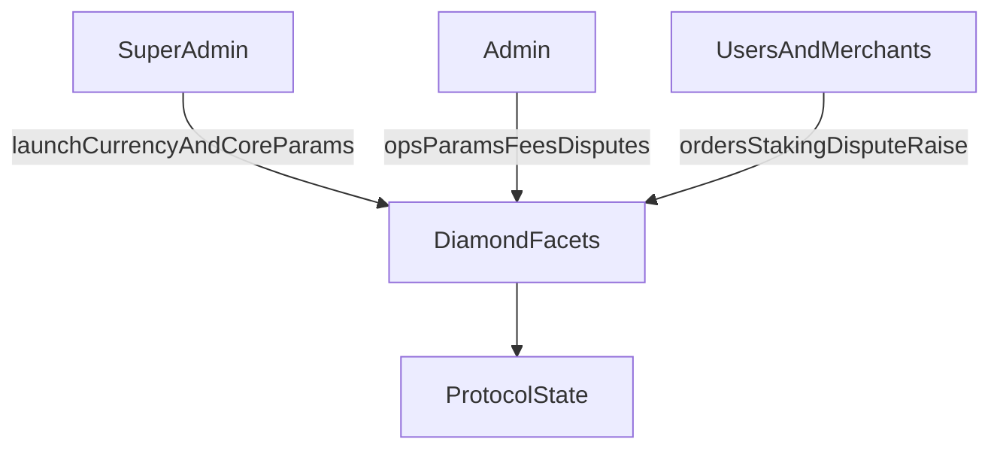
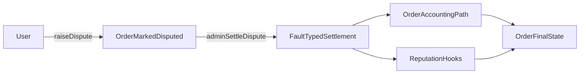

# P2P Protocol Governance

## Roles and Permissions

The protocol defines three governance scopes.

**Super admin** launches currencies, sets core risk/limit parameters, and manages critical protocol configuration.

**Admin** manages operational parameters including spread, merchant fee percentages, disputes, and merchant/payment-channel actions.

**Merchant and user** scope covers order lifecycle, staking/registration flows, and dispute initiation according to contract rules.

---

## Protocol Parameters

Protocol behavior is heavily parameterized rather than hardcoded because markets differ. A spread that works for INR/USDC on UPI rails would be wrong for BRL/USDC on PIX. Parameterization lets the protocol adapt per-currency without redeploying contracts.

**Pricing and spread.** Base spread and price bump by currency, adjusted for local liquidity conditions.

**Risk limits.** Min stake, volume caps, RP-per-USDT limits, and max tx limits. These gate how much risk the protocol takes per merchant and per user.

**Fee controls.** Merchant fee percentage and small-order fixed fees, tuned to make micro-transactions viable without subsidizing them.

**Operational controls.** Currency and payment-channel activation lifecycles.

These parameters are actively governed today by admin roles. Token holders will assume this function through the governance transition described below.

---

## Disputes

A user raises a dispute for an order if timing and state conditions are met. The order is marked disputed, merchant dispute state is updated, and an admin settles with a fault type (`USER`, `MERCHANT`, or `BANK`). Settlement triggers order/accounting paths and RP updates via hooks.

Constraints in the current logic.

- Dispute windows differ by order type.
- A dispute cannot be raised twice.
- Settlement requires admin authorization.

*Jury-based escalation tiers (T1 resolver, T2 jury, T3 token-governance) and SLA-based auto-escalation are planned for a future release.*

---

## Reputation

Reputation Points (RP) control who can do what on the protocol. RP directly governs transaction limits, dispute outcomes, and reward eligibility.

RP integrates with order processing through whitelisted hooks.

- Volume-driven RP growth rewards consistent participation.
- Dispute losses impose RP penalties that reduce future capacity.
- Verification signals (Aadhaar, social, passport) gate reward claims without requiring raw PII on-chain.

When token governance activates, RP and token voting become complementary. Tokens govern rules and reputation governs access.

---

## Token-Holder Governance

The target model gives token holders direct control over protocol parameters, treasury, and upgrades.

| Parameter | Value |
|-----------|-------|
| Voting Power | 1 staked $P2P = 1 vote (delegatable) |
| Voting Delay | 1 day |
| Voting Period | 7 days |
| Standard Quorum | 4% |
| Critical Quorum | 20% |
| Standard Majority | 50% + 1 |
| Critical Majority | 66% supermajority |
| Timelock | 7 days before execution |

Proposals that pass quorum and threshold are queued and executed after timelock. The dual quorum model (4% standard, 20% critical) exists so routine parameter tuning doesn't require mobilizing the entire token base, while high-impact changes demand broad consensus.

Governable parameters include fee percentages, spread configuration, staking and slashing rules, transaction volume limits, treasury allocation, smart contract upgrades, and token whitelisting.

*Token-holder governance activates in phases. Phase 1 (months 0-6) uses foundation multisig. Phase 2 (months 6-18) enables token-holder voting on non-critical parameters. Phase 3 (month 18+) transfers full control to token holders and sunsets foundation veto authority. A unified proposal system covering disputes, claims, audits, and parameter changes is planned for a future release.*

---

## Insurance

The protocol design includes a three-tier insurance stack.

**CAIP (Circle Admin Insurance Pool).** First-line coverage funded by a percentage of Circle volume plus slashed stakes.

**CALR (Circle Admin Locked Rewards).** A portion of admin earnings locked in a rolling buffer. If collusion or negligence is detected, CALR is slashed before the admin can withdraw.

**PIP (Protocol Insurance Pool).** Backstop for systemic failures or when lower-tier pools are depleted. Large PIP claims require governance approval.

*The full insurance-pool stack with programmable slash/reward logic and dispute-linked payouts is planned for a future release.*

---

## Contract References

- `facets/CountryFacet.sol` (currency and payment-channel config governance)
- `facets/P2pConfigFacet.sol` (pricing, spread, admin configuration)
- `facets/OrderProcessorFacet.sol` (disputes, limits, thresholds)
- `facets/MerchantRegistryFacet.sol` and `facets/MerchantOnboardFacet.sol` (merchant controls, fees, stake/unstake)
- `ReputationManager.sol` (RP hooks, reward/verification gating)
