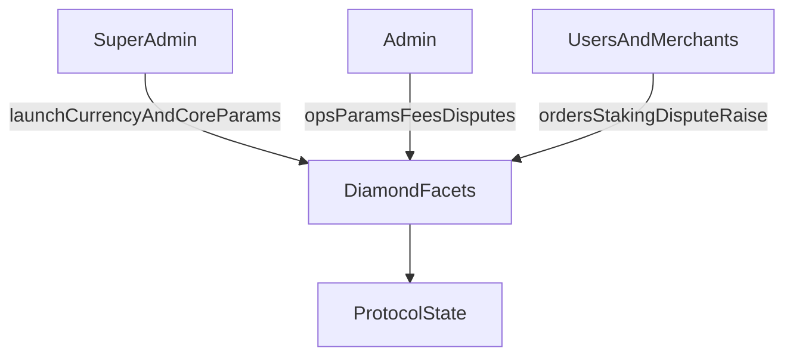
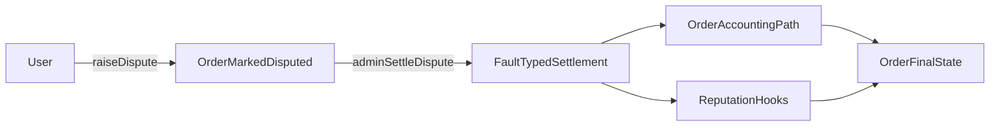
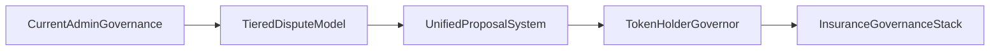

# P2P Protocol Governance

## Implementation Status

### Implemented On-Chain Now

- Diamond-based protocol contracts with facet-level admin controls.
- Currency-level launch and parameterization (`launchCurrency`) for limits, fees, matching count, and small-order fee/threshold.
- User-initiated disputes with explicit dispute windows.
- Admin-settled dispute outcomes via fault typing, with RP and order-state hooks.
- Reputation system (RP) integrated with order flow and gated reward claims.

### Roadmap / Proposed Architecture

- Tiered dispute governance with juries and token-voting finality.
- Unified governor proposal system for disputes, insurance, audits, and parameter changes.
- Full insurance-pool stack (CAIP/CALR/PIP) as a complete on-chain governance primitive.

---

## What Is Live Today

### 1) Governance Surface in Contracts

Governance and control are currently executed through role-gated admin functions in the diamond facets, rather than through an on-chain OpenZeppelin Governor module in this repository.

The protocol defines three governance scopes.

- **Super admin scope** launches currencies, sets core risk/limit parameters, and manages critical protocol configuration.
- **Admin scope** manages operational parameters (for example spread, merchant fee percentages, disputes, and merchant/payment-channel actions).
- **Merchant/user scope** interacts with order lifecycle, staking/registration flows, and dispute initiation according to contract rules.

This reflects an operator-managed governance phase with explicit on-chain permissions and events.

### 2) Dispute Mechanics (Current)

The current dispute flow is contract-native and admin-resolved.

1. A user raises a dispute for an order if timing and state conditions are met.
2. The order is marked disputed, and merchant dispute state is updated.
3. An admin settles with a fault type (`USER`, `MERCHANT`, or `BANK`).
4. Settlement triggers order/accounting paths and RP updates via hooks.

Important constraints exist in the current logic.

- Dispute windows differ by order type.
- A dispute cannot be raised twice.
- Settlement requires admin authorization.
- The current design is deterministic and on-chain. Jury tiers and token-vote escalation are planned for future implementation.

### 3) Parameter Governance (Current)

Protocol behavior is heavily parameterized rather than hardcoded because markets differ. A spread that works for INR/USDC on UPI rails would be wrong for BRL/USDC on PIX. Parameterization lets the protocol adapt per-currency without redeploying contracts.

The key parameter categories are listed below.

- **Pricing and spread** covers base spread and price bump by currency, adjusted for local liquidity conditions.
- **Risk limits** include min stake, volume caps, RP-per-USDT limits, and max tx limits. These gate how much risk the protocol takes per merchant and per user.
- **Fee controls** cover merchant fee percentage and small-order fixed fees, tuned to make micro-transactions viable without subsidizing them.
- **Operational controls** manage currency and payment-channel activation lifecycles.

These parameters are live and actively governed today by admin roles. Token holders will assume this function in a future phase. The mechanics of on-chain governance already exist. What changes over time is who holds the keys.

### 4) Reputation as a Live Control Plane

Before token governance is fully active, RP already governs who can do what on the protocol. Reputation directly controls transaction limits, dispute outcomes, and reward eligibility.

RP integrates with order processing through whitelisted hooks.

- Volume-driven RP growth rewards consistent participation.
- Dispute losses impose RP penalties that reduce future capacity.
- Verification signals (Aadhaar, social, passport) gate reward claims without requiring raw PII on-chain.

This means the protocol has a working quality-control layer today, independent of token governance. When token governance activates, RP and token voting become complementary. Tokens govern rules and reputation governs access.

---

## Current Contract References

The following contract surfaces represent the live governance model.

- `facets/CountryFacet.sol` (`launchCurrency`, currency and payment-channel config governance)
- `facets/P2pConfigFacet.sol` (pricing/spread/admin configuration)
- `facets/OrderProcessorFacet.sol` (`raiseDispute`, `adminSettleDispute`, limits, thresholds)
- `facets/MerchantRegistryFacet.sol` and `facets/MerchantOnboardFacet.sol` (merchant controls, fees, stake/unstake and status actions)
- `ReputationManager.sol` (RP hooks, reward/verification gating)

---

## Roadmap (Not Yet Implemented On-Chain In This Repo)

The following items remain part of the intended governance direction. They should be treated as roadmap design rather than current behavior.

### A) Multi-Tier Dispute Governance

- T1 resolver stage, T2 jury stage, and T3 token-governance stage.
- SLA-based auto-escalation and explicit appeal windows across tiers.

### B) Unified Proposal System

- A single proposal primitive covering disputes, claims, audits, and parameter changes.
- Standardized proposal states and execution windows.

### C) Insurance Governance Stack

- CAIP/CALR/PIP pool hierarchy with programmable slash/reward logic and dispute-linked payouts.

### D) Token-Holder Native Governor

- Full protocol decision-making by `$P2P` token governance with differentiated quorum/rules by proposal class.

---

## Reading Guide

Sections labeled "Implemented" reflect deployed contract behavior. Sections labeled "Roadmap" are design intent. For integration work, validate against deployed ABIs and the contracts listed above.
