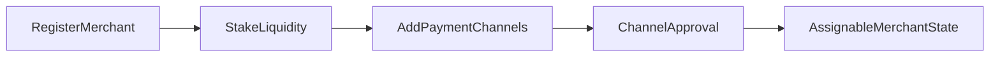
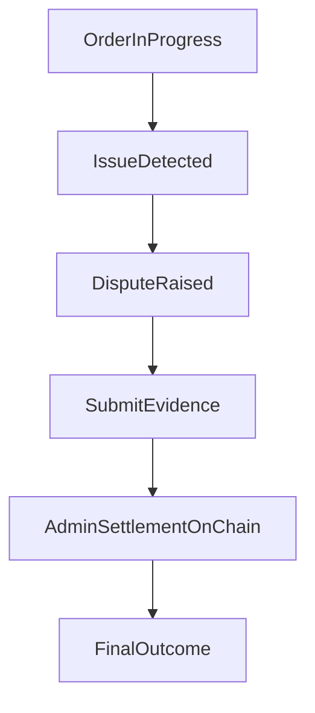

# P2P Protocol Merchant Guide

## Start Here

- New merchant operator? Read this guide first, then review the [`User Guide`](/user-guide) to understand user-side expectations.
- For live merchant-registry model context, read [`Circles of Trust`](/circles-of-trust).
- For current dispute and parameter governance behavior, read [`Governance`](/governance).
- For upcoming expansion tracks, read [`Roadmap Features`](/roadmap-features).

---

## 1. Merchant Readiness

Before operating, ensure you have the following.

- A wallet connected through a supported client/admin interface.
- Required settlement liquidity for supported currency operations.
- Active payment rails/accounts you can operationally maintain.

---

## 2. Merchant Setup Flow

### Step 1: Register and Stake

1. Register as merchant for an active currency.
2. Stake required settlement liquidity.
3. Confirm your merchant profile and operational status.

### Step 2: Add Payment Channels

1. Add payment channels for your supported rails.
2. Wait for required approval states.
3. Keep approved channels active and up to date.

---

## 3. Handling Orders

### Accepting Orders

1. Monitor assigned orders.
2. Accept orders promptly.
3. Follow the settlement steps by order type.

### Completing Orders

- Confirm payment actions as required by the flow.
- Ensure finalization steps are completed in-app.
- Keep records/evidence for dispute scenarios.

---

## 4. Operational Controls

As a merchant, you should routinely perform the following.

- Keep channels active only when you can service them.
- Maintain sufficient liquidity for expected order load.
- Monitor order states and ongoing-order constraints.
- Withdraw accrued fees via supported flow.
- Use unstake/request flows when reducing or exiting activity.

---

## 5. Disputes and Evidence

If a dispute is raised, follow these steps.

1. Review order context and timestamps.
2. Submit supporting evidence in-app (including ZK/TLS-backed proofs where available).
3. Follow settlement updates and resulting order state transitions.

Disputes are settled on-chain by authorized admins under protocol fault rules and dispute windows.

---

## 6. Risk and Reliability Practices

- Respond quickly to assigned orders.
- Keep channel metadata and payment details accurate.
- Avoid operating channels when unavailable.
- Preserve evidence trails for contested payments.
- Treat cancellations and disputes as quality signals to improve operations.

---

## 7. Troubleshooting

### Not getting assigned orders

- Confirm you are online and channels are approved/active.
- Confirm operational availability and liquidity sufficiency.

### Orders frequently cancelled

- Review response speed and settlement completion discipline.
- Ensure payment channel details and balances are current.

### Unable to complete payout or settlement path

- Re-check channel readiness and app prompts.
- Escalate using supported admin/ops process if needed.

### Fee withdrawal not available

- Confirm you have accrued withdrawable fees and no blocking state.
- Retry through supported merchant operations interface.

---

## 8. FAQs

### Do I need to know internal scoring criteria?

No. Operate based on app-visible status, liquidity requirements, and channel approval states.

### Can I run multiple payment channels?

Yes, each subject to its own approval and volume limits.

### What happens if a user disputes my order?

Submit evidence promptly. The dispute resolves on-chain based on fault determination and the evidence provided.

### Can I pause order assignments?

Yes. Toggle online/offline status or deactivate channels when you can't service orders.

### Where are the exact numeric thresholds?

Thresholds visible in your deployment/client are operational. Internal scoring criteria are not publicly documented.
