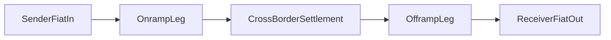
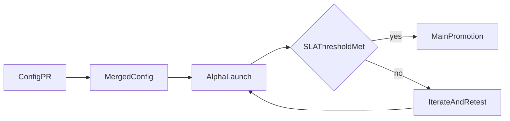

# P2P Protocol Roadmap Features

## Start Here

This page highlights the highest-priority product roadmap features currently proposed from the `@features/` planning documents.

Current focus areas.

1. **End-to-End Fiat-to-Fiat Remittance**
2. **Global Currency Expansion (Alpha -> Main lifecycle)**

These tracks matter for the following reasons.

- Core protocol rails already exist, so these tracks are expansion layers rather than zero-to-one invention.
- Both tracks are designed to increase reachable users, corridors, and transaction throughput.
- If executed, they can compound token utility through broader network participation and governance relevance.

---

## 1. End-to-End Fiat-to-Fiat Remittance

### The idea

The protocol already settles fiat-to-stablecoin and stablecoin-to-fiat independently. Remittance is what happens when you chain these two legs together atomically. The sender pays fiat in Country A, the receiver gets fiat in Country B, and the stablecoin hop in the middle is invisible to both.

### Example Flow

- Sender in Country A initiates transfer in local fiat.
- Protocol settles intermediate value rails.
- Receiver in Country B receives local fiat payout.

### What this reuses

Onramp, offramp, dispute, and matching rails all exist. No new trust assumptions are needed. The same merchant staking, RP gating, and settlement logic applies to each leg independently. The key insight is that remittance is purely a composition problem built from existing primitives.

### What's new

- A linked order type that atomically connects onramp and offramp legs
- An escrow contract holding stablecoin between legs (so failure on one side refunds the other)
- A receiver claim flow for recipients who don't already have accounts
- Cross-currency quote display and transparent fee breakdown

### Why it matters

Remittance unlocks a much larger addressable market without rebuilding the protocol. Every existing corridor becomes a potential remittance corridor. The user who sends money home doesn't need to understand stablecoins. They see fiat in, fiat out.

---

## 2. Global Currency Expansion

### The idea

Adding a new country today requires manual coordination with no standard process. Local knowledge is siloed. This includes which rails are free, which QR formats work, and what settlement times look like. The expansion framework solves this by making country configs open-source and promotion criteria transparent.

### Core proposal

- Open-source country YAML configs capturing local payment-rail knowledge
- Alpha environment where new currencies launch with explicit "no SLA guaranteed" framing
- Public health metrics (settlement rate, dispute rate, volume) that gate promotion to the main app

### Main building blocks

- Country-level config schema (currency, channels, limits, fees, feeds)
- App-side config consumption
- Contract-side configuration execution
- Alpha/Main lifecycle operations
- Public dashboard metrics for settlement/dispute/volume health

### Why it matters

The bottleneck for geographic expansion is local knowledge. Open-source configs let anyone with local expertise propose a new currency. Public SLA gates ensure quality without requiring HQ to manually evaluate every market. The result is a scalable expansion model where community contribution directly increases protocol reach.

---

## Suggested Rollout Sequence

### Phase A: Foundation

- Ship config standards, alpha lifecycle, and operational dashboards

### Phase B: Remittance MVP

- Launch single high-priority corridor with linked-order + escrow path

### Phase C: Scale

- Expand corridors and currencies using measured SLA gates
- Improve receiver claim UX and automation layers
