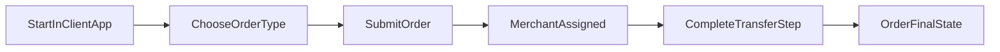

# P2P Protocol User Guide

## Start Here

- New to operations? Read this guide start to finish, then review the [`Merchant Guide`](/merchant-guide) to understand counterparty actions.
- For system and assignment model context, read [`Circles of Trust`](/circles-of-trust).
- For dispute/governance behavior in production, read [`Governance`](/governance).
- For upcoming product capabilities, read [`Roadmap Features`](/roadmap-features).

---

## 1. Before You Start

### What You Need

- A supported wallet connected through a P2P Protocol client app.
- Access to supported payment rails in your region.
- Stablecoin balance for SELL/PAY flows.

### Basic Safety Checks

- Confirm the app domain and wallet network before signing.
- Verify order details (amount, currency, recipient) before submission.
- Do not share private keys, seed phrases, or wallet recovery data.

---

## 2. Order Types

- **BUY.** You pay fiat and receive stablecoin.
- **SELL.** You transfer stablecoin and receive fiat.
- **PAY.** You transfer stablecoin for payment use cases where fiat settlement rails are involved.

---

## 3. How to Place an Order

1. Open the app and select `BUY`, `SELL`, or `PAY`.
2. Enter amount and required recipient/payment details.
3. Submit order and wait for merchant assignment.
4. Follow app prompts for transfer and confirmation.

---

## 4. What To Do By Order Type

### BUY (Fiat -> Stablecoin)

1. Place BUY order.
2. Receive assigned merchant payment details.
3. Send fiat using the instructed rail.
4. Complete required in-app confirmation.
5. Track order until completion.

### SELL / PAY (Stablecoin -> Fiat or Payment Rail)

1. Place SELL or PAY order.
2. Approve/transfer stablecoin when prompted.
3. Wait for counterparty settlement actions.
4. Confirm and track until completion.

---

## 5. Understanding Order States

Common order statuses.

| Status | Meaning |
|--------|---------|
| `PLACED` | Order created and pending active handling |
| `ACCEPTED` | A merchant accepted the order |
| `PAID` | Payment leg was marked paid in protocol flow |
| `COMPLETED` | Settlement path finished successfully |
| `CANCELLED` | Order was cancelled or expired |

If your order remains in a state longer than expected, use in-app support/escalation and check dispute eligibility.

---

## 6. Disputes and Evidence

If the counterparty doesn't fulfill their obligation, take the following steps.

1. Open a dispute within the allowed time window.
2. Submit evidence in-app (ZK/TLS-backed proofs where available).
3. Monitor dispute status.

Disputes are currently resolved on-chain by authorized admins under protocol fault rules.

---

## 7. Troubleshooting

### Order was cancelled unexpectedly

- Check whether the order expired or a transfer step failed.
- Recreate order with correct details and complete steps promptly.

### Merchant not responding

- Wait for the protocol reassignment/timeout path where applicable.
- If conditions are met, raise a dispute with evidence.

### Transfer failed

- Confirm token approval/balance for SELL/PAY.
- Confirm rail details and payment confirmation steps for BUY.

---

## 8. FAQs

### Do I need to understand on-chain mechanics?

No. The client app handles all contract interaction. Follow status prompts.

### Why wasn't my order matched instantly?

Merchant assignment depends on real-time eligibility factors, including liquidity, channel status, volume limits, and operational availability. If no merchant qualifies, the order waits or times out.

### Can I appeal a dispute?

Use the in-app dispute process. The roadmap includes governance-driven escalation tiers, but today disputes are admin-settled.

### Is my identity stored on-chain?

No raw PII is stored on-chain. The protocol uses ZK proofs and attestation hashes. Only commitments and verdicts are public.

### How do I know what to do next?

Your order status (`PLACED`, `ACCEPTED`, `PAID`, `COMPLETED`, `CANCELLED`) tells you. Each status implies a specific next action. The app guides you through it.
