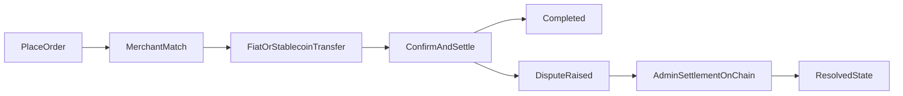

# P2P Protocol Whitepaper

**P2P Protocol: Decentralized P2P On/Off Ramps & A Gateway to DeFi**

*www.p2p.me*

## Abstract

Following the wake of centralized exchanges, early decentralized exchanges led the DeFi movement using order books and liquidity pools. Yet DeFi users still lacked a fully decentralized way to onramp from fiat to crypto and offramp back to fiat.

P2P Protocol reflects a departure from fiat escrows and traditional custodians by using zero-knowledge (ZK) proofs for non-custodial KYC, making on/off-ramps privacy-preserving and governed by users' collective interests. An evidence module for on-chain dispute resolution and bank transaction verification is on the roadmap.

Based on the Base network, P2P Protocol trustlessly matches buyers and highly vetted merchants according to a Proof-of-Credibility reputation algorithm, settles trades with on-chain coordination, and resolves disputes through on-chain admin settlement rather than platform custody. This paper formalizes design goals, protocol flows, reputation, dispute resolution, pricing, security and privacy models, governance, and token economics in preparation for a Token Generation Event (TGE) planned for March 2026.

The end-state is a credibility-based DeFi ecosystem where peers transact, save, and build services on top of an open Proof-of-Credibility graph—useful, easy to use, privacy-first, and not reliant on over-collateralized mechanics for every everyday action. This paper lays out that vision, the principles guiding it, what works today, and the path to a mature, protocol-neutral, global network by and beyond 2026.

---

## 1. The Vision

### 1.1 From "ramps" to a privacy and credibility based economy

P2P Protocol starts with the most practical chokepoint—moving between fiat and stablecoins—without custodial escrow. The same rails, proofs, and incentives that make an honest ramp work at scale also enable the next layer: credibility-based liquidity, bridging the gap between fiat and crypto currencies, for all DeFi.

In this model:

- **Reputation** is earned on-chain through completed trades, clean dispute histories, and ZK-KYC tiers—not through centralized account vetting.
- **Privacy** is preserved by default via zero-knowledge proofs for identity verification, revealing only that a user is verified and permitted—without exposing raw identities.
- **Usefulness** beats theory: micro-payments, everyday off-ramps, wages, remittances, and merchant payouts come first—designed to feel as simple as sending a message.

### 1.2 What "good" looks like by 2026+

- A user in any supported country can buy or sell stablecoins in ~minutes—targeting sub-90-second completion on fast rails—without giving custody to anyone.
- Merchants are matched based on reliability and Proof-of-Credibility scores, with spread set at the protocol level rather than through merchant competition.
- ZK-KYC unlocks higher limits and faster paths while keeping personal data off-chain. A planned evidence module for bank transaction verification will further extend privacy-preserving proofs to dispute resolution.
- Third-party apps and wallets integrate the protocol through open SDKs; Coins.me is only a reference consumer front-end, not a privileged gateway.
- As credibility compounds, new products (installment payouts, escrowless commerce, cross-border salaries, dispute insurance) can be built without re-KYCing the world.

### 1.3 First principles

1. **Non-custodial by construction.** No fiat escrow. Crypto only held atomically for settlement where necessary.
2. **Privacy-preserving.** Prove what's needed; reveal nothing else.
3. **Credible neutrality.** Open rules, upgradeable by governance; no special routes for any client.
4. **Useful and simple.** The experience should feel like one tap to "Buy USDC" or "Cash out," with the protocol handling the invisible complexity.
5. **Protocol-agnostic.** The design does not hinge on any single L2, oracle, or proof vendor. Implementations can change without rewriting the whitepaper.

### 1.4 What P2P Protocol is (and is not)

**Is:** an open, decentralized coordination layer that trustlessly matches a buyer with a highly vetted merchant according to a transparent reputation system; settles trades with on-chain coordination; and routes fees and parameters through governance.

**Is not:** a custodian, a bank, or a data broker. P2P Protocol does not custody fiat, does not warehouse users' personal information, and does not promise fixed yields.

### 1.5 Why this matters now

Over the past decade, crypto solved programmatic finance but left the real world at the door. Today three curves finally cross:

- Instant local rails (UPI/PIX/QRIS & peers) are mainstream.
- Practical ZK can attest to real-world facts without exposing the data—already used for identity verification, with bank transaction proofs on the roadmap.
- L2s and stablecoins have made small payments cheap and fast enough to care about.

P2P Protocol sits exactly at that intersection. It turns *trust me* into *prove it*, and it does so without handing anyone your money or your identity.

### 1.6 North-star outcomes (what "good" looks like to us)

By 2026+:

- Sub-90-second settlement on fast rails, median cost under $0.20 per $100.
- \>99% disputes resolved by proofs within the window, not by moderators.
- Portable credibility: your reputation and limits travel with you across clients and countries—without doxxing you.
- Neutral access: multiple wallets and apps, including Coins.me as a reference, all using the same permissionless SDKs atop the Protocol.
- Everyday usefulness: wages, remittances, marketplace payouts, and checkout—no custody, no paper KYC forms, no screenshots.

### 1.7 Credibility-based DeFi (beyond over-collateralization)

Over-collateralization made early DeFi safe, but it makes the everyday world feel gated and expensive. P2P Protocol proposes a second pillar: **credibility**.

- Earned limits and better prices come from clean history, completed trades, and ZK-KYC tiers, not from locking 200% collateral or gaming the system.
- Privacy by default: you reveal proofs of action, not identities.
- Composability: the same credibility graph supports installment payouts, escrowless commerce, and even lightweight credit primitives in the future.

### 1.8 A protocol for people, not just power users

We design for someone who has a phone and a paycheck, not a Bloomberg terminal.

- **Micro-friendly:** The Protocol must feel safe at $15 as much as at $1,500.
- **Dignity with Privacy:** ZK-KYC verifications prove what's necessary and nothing more, no Personal Identification revelation—protecting freelance workers, activists, and anyone who values privacy.

### 1.9 Protocol-agnostic by design

Vendors and chains will change; the principles cannot. The whitepaper commits to:

- No single L2, oracle, or proof provider baked into the logic.
- Clear interfaces (verifier registry, oracle adapter, rail registry) so parts can be swapped without rewriting the paper or the social contract.
- Open Sourcing and Decentralizing each part of the Protocol as public goods.

### 1.10 Credibility but with Privacy

Think of P2P Protocol's Proof-of-Credibility as a public good in itself:

- It's earned, decays over time, and is hard to game.
- It is portable across clients and countries via on-chain commitments, not PDFs in someone's inbox.
- It's privacy-first: only commitments and verdicts are public; raw evidence stays with you or your chosen verifier.

### 1.11 Programmable compliance (policy without dossiers)

Most people want two things at once: privacy and legality. P2P Protocol makes this practical:

- **Policy-as-parameters:** rails, timeouts, and proof requirements are governed on-chain by region and risk class.
- **ZK-KYC tiers** satisfy "permitted user" checks while keeping PII off-chain.
- **Travel-Rule-style needs** can be met via selective disclosure circuits (planned) when a counterparty is a registered business—without turning the protocol into a data broker.

### 1.12 What gets unlocked if we get this right

- **Borderless income:** creators, contractors, and remote workers get paid where they live, without exchange custody.
- **Merchant payouts:** marketplaces settle to sellers in local rails instantaneously, at fair spreads, with no CSV juggling.
- **Community finance:** rotating savings, micro-loans, and escrowless marketplaces can build on a shared credibility and liquidity layer between the fiat and crypto currency domains.
- **Civic resilience:** people can move value privately and lawfully when the world gets shaky.

### 1.13 Stewardship & governance philosophy

- Credible neutrality over convenience. Changes go through transparent governance with guardrails (timelocks, narrow pauses, audits).
- Minimize governance where possible: parametrize, don't micromanage.
- Public safety valves: oracle circuit breakers, verifier sunsets, and emergency pauses with automatic expiry.
- Open bounty mindset: pay to find flaws early; publish fixes openly.

### 1.14 What we won't compromise on

- Non-custody of fiat (ever).
- No honeypots of PII (Personal Identifiable Information) on-chain (ever).
- No privileged clients (ever). Everyone uses the same pipes.
- No "trust us" black boxes. If it can't be proven or audited, it doesn't make core.

### 1.15 Milestones that matter 

- **Ubiquity:** a credible merchant presence in every major region/rail pair.
- **Geographic reach:** expansion to 20+ markets across Asia, Africa, Latin America, and MENA.
- **Multi-chain presence:** support for additional networks including Solana and emerging high-performance chains.
- **Composability:** third-party apps shipping useful features on the SDK without asking permission.
- **Self-serve legitimacy:** regulators and risk teams can read the spec, verify parameters on-chain, and understand how safety is achieved—without backdoors.
- **Roadmap features:** for current feature-track proposals (including remittance and currency expansion), see [`/for-builders`](/for-builders/start-here).

### 1.16 A short manifesto

> Privacy is a user interface problem as much as a math problem.

> Reputation should be earned, portable, and revoke-able—never sold.

> The best KYC is the one that proves what's needed and nothing else.

> If only power users can use it, it isn't DeFi—it's a gated club.

---

## How the protocol works today (high level, implementation-aware)

1. **Placing orders.** A user clicks "Buy USDC" (or "Sell USDC") and enters an amount. Users sign in through the app's integrated wallet to start transacting.
2. **Order matching.** An innovative Proof-of-Credibility algorithm keeps a list of carefully vetted stablecoin merchants queued for order matching. A fiat payment address is shared over the smart contract, encrypted via the user's keys; for off-ramps, a wallet address is presented.
3. **Transfers and confirmation.** The payer completes the fiat or crypto transfer; the counterparty acknowledges receipt. Settlement completes within minutes in the common case.
4. **Disputes.** If a party files a dispute, either side can submit evidence without disclosing unnecessary personal data. Under current contracts, disputes are raised by users within defined windows and settled by authorized admins on-chain.
5. **On-chain operations.** Order state, matching, settlement accounting, and dispute state transitions are on-chain. An evidence module for on-chain dispute resolution and bank transaction verification is planned as the protocol evolves.

---

## Why credibility matters (and why over-collateralization shouldn't be the only answer)

Traditional DeFi often reaches for heavy collateral to feel safe. That works for some instruments, but it makes everyday finance clunky and exclusionary. Credibility-based DeFi says: let peers earn limits, speed, and price by behaving well over time, with ZK-KYC protecting identity privacy along the way.

This strikes a better balance: useful for real people, privacy-preserving for those who need it most, and resilient because reputation is distributed and portable—not trapped in a single platform's database.

---

## 2. Design Goals and Non-Goals

### 2.1 Goals

- Decentralized on/off-ramp between fiat and stablecoins without fiat escrow.
- Privacy by design using ZK proofs for identity verification while keeping raw data off-chain. A planned evidence module will extend privacy-preserving verification to bank transaction events.
- Credible neutrality: protocol-level rules are open, transparent, and upgradable via governance.
- Fast settlement: typical completion within minutes, targeting sub-~90s for common rails as network, liquidity, and automation improve.
- Safety & integrity: explicit threat model, dispute flows, and rate/limit controls to minimize fraud.

### 2.2 Non-Goals

- The Protocol does not hold customer fiat or crypto in custody.
- The Protocol does not guarantee price or liquidity; it coordinates peers and market inputs.
- The Protocol does not store personal data on behalf of users; it records necessary commitments and verdicts on-chain while raw evidence remains off-chain.

---

## 3. System Overview

### 3.1 Actors

The protocol involves several key participants working together to enable trustless peer-to-peer transactions.

**Buyers and Sellers** are everyday users who initiate on-ramp or off-ramp orders. They interact with the protocol through client applications using integrated wallets and transacting without surrendering custody of their funds.

**Merchants**, also known as liquidity peers, serve as the counterparties who mediate liquidity between stablecoins and fiat currencies. These are carefully vetted participants who maintain sufficient liquidity and have established strong reputations through the Proof-of-Credibility system.

**Protocol Contracts** are the on-chain smart contracts that orchestrate the entire order lifecycle. They handle order queuing, matching based on credibility scores, state verification, and final settlement outcomes. These contracts operate transparently on Base L2.

**Proof Verifiers** currently validate ZK-KYC proofs for identity verification (government IDs, social accounts, and passports via Reclaim Protocol and other ZK verifiers). A planned evidence module will extend proof verification to bank transaction verification for on-chain dispute resolution.

**Governance** encompasses the mechanisms through which protocol parameters, upgrades, and treasury decisions are made. The current implementation is admin/multisig operated, with a planned transition to broader token-holder governance as the protocol matures.

### 3.2 Components

- **Base L2 smart contracts** for order lifecycle, matching, dispute windows, parameter registry, and fee routing.
- **Reputation registry** implementing Proof-of-Credibility (inputs, scoring, decay).
- **Oracle adapter** for reference pricing and safeguards (median/TWAP, fallbacks, circuit breakers).
- **Client SDKs** and reference apps (e.g., Coins.me) that speak the protocol.

### 3.3 High-Level Flow

1. **Placing Orders:** A user clicks "Buy USDC" (or "Sell USDC") and enters amount. The app provides an integrated wallet for the transaction.
2. **Order Matching:** A list of carefully vetted merchants is queued via Proof-of-Credibility. A fiat payment address is shared over the smart contract, encrypted with the user's keys; for off-ramps, a Base USDC address is presented.
3. **Fiat/Stablecoin Transfer:** The payer performs the transfer on the designated rail.
4. **Confirmation/Settlement:** Within minutes, settlement succeeds once the merchant confirms receipt. Wallet balances update accordingly.
5. **Dispute Window:** If a party contests, they submit evidence that a payment or action occurred (or did not). In the live implementation, authorized admins settle disputed orders on-chain according to protocol fault rules and dispute windows. A planned evidence module will enable privacy-preserving proof submission for bank transaction verification.



### 3.4 On-Ramp Flow

```
┌─────────────────────────────────────────────────────────────────────────┐
│                         ON-RAMP FLOW (Fiat → USDC)                      │
├─────────────────────────────────────────────────────────────────────────┤
│                                                                         │
│   ┌──────────┐         ┌──────────────┐         ┌──────────────┐        │
│   │   USER   │         │   PROTOCOL   │         │   MERCHANT   │        │
│   └────┬─────┘         └──────┬───────┘         └──────┬───────┘        │
│        │                      │                        │                │
│        │  1. Open BUY order   │                        │                │
│        │  (amount + rail)     │                        │                │
│        │─────────────────────►│                        │                │
│        │                      │                        │                │
│        │                      │  2. Match via PoC      │                │
│        │                      │  (credibility score)   │                │
│        │                      │───────────────────────►│                │
│        │                      │                        │                │
│        │  3. Receive fiat     │                        │                │
│        │  payment address     │                        │                │
│        │◄─────────────────────│                        │                │
│        │  (encrypted)         │                        │                │
│        │                      │                        │                │
│        │  4. Transfer fiat    │                        │                │
│        │  via bank/UPI/PIX    │                        │                │
│        │──────────────────────────────────────────────►│                │
│        │                      │                        │                │
│        │                      │  5. Merchant confirms  │                │
│        │                      │  receipt               │                │
│        │                      │◄───────────────────────│                │
│        │                      │                        │                │
│        │  6. USDC released    │                        │                │
│        │  to user wallet      │                        │                │
│        │◄─────────────────────│                        │                │
│        │                      │                        │                │
│   ┌────▼─────┐         ┌──────▼───────┐         ┌──────▼───────┐        │
│   │  USDC    │         │    FEES      │         │   BONDS      │        │
│   │ RECEIVED │         │  COLLECTED   │         │  UNLOCKED    │        │
│   └──────────┘         └──────────────┘         └──────────────┘        │
│                                                                         │
└─────────────────────────────────────────────────────────────────────────┘
```

### 3.5 Off-Ramp Flow

```
┌─────────────────────────────────────────────────────────────────────────┐
│                        OFF-RAMP FLOW (USDC → Fiat)                      │
├─────────────────────────────────────────────────────────────────────────┤
│                                                                         │
│   ┌──────────┐         ┌──────────────┐         ┌──────────────┐        │
│   │   USER   │         │   PROTOCOL   │         │   MERCHANT   │        │
│   └────┬─────┘         └──────┬───────┘         └──────┬───────┘        │
│        │                      │                        │                │
│        │  1. Open SELL order  │                        │                │
│        │  + lock USDC         │                        │                │
│        │─────────────────────►│                        │                │
│        │                      │                        │                │
│        │                      │  2. Match via PoC      │                │
│        │                      │  + merchant posts bond │                │
│        │                      │───────────────────────►│                │
│        │                      │                        │                │
│        │  3. Share fiat       │                        │                │
│        │  receiving address   │                        │                │
│        │─────────────────────►│                        │                │
│        │  (encrypted)         │                        │                │
│        │                      │                        │                │
│        │                      │  4. Merchant sends     │                │
│        │  Fiat received       │  fiat payment          │                │
│        │◄──────────────────────────────────────────────│                │
│        │                      │                        │                │
│        │                      │  5. Merchant submits   │                │
│        │                      │  payment confirmation  │                │
│        │                      │◄───────────────────────│                │
│        │                      │                        │                │
│        │                      │  6. USDC released      │                │
│        │                      │  to merchant           │                │
│        │                      │───────────────────────►│                │
│        │                      │                        │                │
│   ┌────▼─────┐         ┌──────▼───────┐         ┌──────▼───────┐        │
│   │  FIAT    │         │    FEES      │         │    USDC      │        │
│   │ RECEIVED │         │  COLLECTED   │         │  RECEIVED    │        │
│   └──────────┘         └──────────────┘         └──────────────┘        │
│                                                                         │
└─────────────────────────────────────────────────────────────────────────┘
```

### 3.6 Key Considerations

- The **merchant** serves the function of mediating liquidity for the transactions.
- The **onus of confirming payment** rests on the merchant (for off-ramps) or can be provided by either party.
- **ZK-KYC performs trustless identity verification** for the user without exposing personal data.
- **Evidence is submitted and reviewed** in disputes. In the current system, outcomes are executed via on-chain admin settlement. A planned evidence module will enable on-chain dispute resolution with privacy-preserving bank transaction verification; broader verifier and governance-driven resolution remains roadmap.
- **Reclaim Protocol** enables privacy-preserving identity verification via social accounts and government IDs.

---

## 4. Cryptographic Primitives & Proof Integration

### 4.1 Identity Verification (Live)

P2P Protocol uses ZK proofs for privacy-preserving identity verification. A new member can perform trustless KYC by sharing a ZK proof of their identity—keeping their personal data private while building on-chain reputation and unlocking higher transaction limits without revealing raw PII on-chain.

The protocol currently supports identity verification through multiple ZK-based methods:

- **Government ID verification** via on-chain ZK proof verifiers for supported identity documents.
- **Social account verification** via **Reclaim Protocol** [1], which uses zkTLS proofs to verify ownership and standing of social accounts (e.g., professional networks, developer platforms, social media) without exposing account credentials or personal data.
- **Passport verification** via ZK proof systems that can verify age, nationality, and sanctions status without disclosing document contents.

Each successful verification strengthens the user's on-chain reputation and expands their transaction capacity within the protocol.

### 4.2 Evidence Module for Bank Transaction Verification (Roadmap)

A planned evidence module will extend the protocol's ZK capabilities to bank transaction verification for on-chain dispute resolution. This module will leverage TLS-backed proofs so that a user or merchant can produce a cryptographic witness that a specific statement about a bank transfer or payment receipt is true—without exposing credentials or transaction details.

The planned module will specify where proofs are verified:

- **On-chain verifier** for compact claims and attestation hashes.
- **Off-chain verifier/relayer** (open-source reference) for complex or rail-specific statements, posting a succinct attestation back on-chain.

> Raw proofs will remain with users; the chain stores only minimal commitments and verdicts.

### 4.3 Privacy Properties

The current ZK-KYC implementation provides:

- **Non-interactive disclosure:** share only the proof, not the underlying data.
- **Selective reveal:** only fields required by the verification circuit are exposed to the circuit.
- **Bounded linkage:** protocol IDs and commitments minimize cross-session linkability where feasible.

The planned evidence module will extend these privacy properties to bank transaction verification.

---

## 5. Trade Protocol (On- and Off-Ramp)

We formalize the order lifecycle as a state machine with timeouts:

**States:** `OPEN → MATCHED → FUNDED → CONFIRMED → SETTLED | DISPUTED → RESOLVED | EXPIRED`

**Common Parameters (governed):**

- `T_match` (max time to accept a match), `T_fiat` (max time to make fiat transfer), `T_confirm` (confirmation window), `T_dispute` (challenge window).
- `B_bond_user`, `B_bond_merchant` (optional performance bonds/slashing weights by reputation tier and payment rail risk class).
- `min_amount`, `max_amount` per rail/region; fee schedules; quote expiry windows.

### 5.1 On-Ramp (Fiat → USDC on Base)

1. **Open:** User opens BUY order with amount & rail.
2. **Match:** Protocol assigns a merchant (highest compatible Proof-of-Credibility and quote). Refundable bonds may lock.
3. **Fund Fiat:** User pays fiat to provided account within `T_fiat`.
4. **Merchant Ack:** Merchant confirms receipt of fiat payment.
5. **Settle:** Contract releases USDC to user; fees assessed; bonds unlocked.
6. **Dispute:** If conflict, parties submit evidence; authorized admins issue on-chain verdict.

### 5.2 Off-Ramp (USDC on Base → Fiat)

1. **Open:** User opens SELL order; transfers USDC to escrowless settlement adapter (contract holds or streams atomically per design).
2. **Match:** Merchant accepts and posts quote/bond.
3. **Fund Crypto:** User's USDC is locked for settlement.
4. **Merchant Pays Fiat:** Merchant pays fiat and confirms completion; or user challenges.
5. **Settle/Dispute:** As above.

### 5.3 Payment-Rail Risk Classes

Rails differ (instant/irreversible vs reversible/chargeback-prone). The protocol maps rails to bond multipliers, confirmation requirements, and longer/shorter dispute windows.

---

## 6. Proof-of-Credibility (Reputation & Matching)

P2P Protocol works using a unique on-chain reputation system which not only builds up user trust and privileges but actively helps prevent fraudulent activity within the P2P landscape.

### 6.1 Building Trust Through Reputation

A user can increase their Reputation Points (RP) score via a series of on-chain tasks which make them more trustworthy in the eyes of the community. From completing anonymous KYC to referring friends, each newly completed task reinforces the user's on-chain reputation while unlocking fresh rights and benefits along with upgraded transaction limits.

### 6.2 Inputs (illustrative, governed)

- Successful trades (size-weighted), age/decay, dispute history.
- KYC proof tier (ZK-KYC completed, source diversity).
- Rail diversity & geography; referral attestations.
- Slashed events (negative deltas), appeals outcomes.

### 6.3 Outputs

- Order limits (min/max), fee tiers, bond multipliers, matching priority.
- Regional caps by compliance policy.

### 6.4 Sybil & Gaming Resistance

- Weighted decay, diminishing returns, rail-mix requirements, and anti-gaming and fraud detection engine checks.
- Optional attested device/account fingerprints (privacy-respecting commitments).

---

## 7. Fraud Prevention

### 7.1 How Reputation Prevents Fraud

Merely making the protocol fully anonymous would do little to preclude the possibility of users misusing the platform. However, combined with the strict reputation system for on-ramp transactions, the chances of a buyer committing impersonation fraud drop drastically, especially given the meager amounts they can transact with their expectedly suspicious on-chain reputation.

It is worth noting that centralized exchanges routinely face difficulties in implementing a viable KYC procedure for their users. The Protocol's non-custodial KYC works just as effectively as a traditional KYC in preventing fraud, while retaining the benefit of anonymity for the user if no illicit activity surfaces over the course of their interaction with the platform.

### 7.2 Anti-Money Laundering Through Transaction Limits

The underlying RP mechanism practically eliminates the risk of money laundering and similar malevolent practices. The transaction limits imposed naturally take care of anti-money laundering compliance. There is simply less of a scope for any non-trivial amount of black money to be laundered given the lack of transactional scalability and the reputational banning risks involved.

### 7.3 Merchant Accountability

The virtually handpicked nature of the peers fulfilling individual orders—via the breakthrough Proof-of-Credibility algorithm—means a serious disincentive and unlikelihood for any merchant to attempt a fraudulent transaction.

---

## 8. Dispute Resolution

The Protocol is designed to minimize unnecessary data disclosure during disputes. If a user files a dispute, the counterparty can submit evidence of the transaction without exposing additional personal data. In the current contract implementation, disputes are resolved on-chain by authorized admins based on submitted evidence and protocol fault rules. A planned evidence module for on-chain dispute resolution and bank transaction verification will enable privacy-preserving proof submission; deeper automated verifier-driven settlement is part of the roadmap.

**Windows & Burdens:** Default onus: the party claiming completion provides evidence of completion. The challenger can present counter-evidence (e.g., bank statement showing non-receipt). Fail-to-prove paths trigger slashing or refunds according to the Protocol rules.

**Penalty for False Claims:** In the event a buyer attempts to proceed without actually making the fiat transfer first, they risk losing Reputation Points—creating strong economic disincentives for fraudulent behavior.

---

## 9. Pricing & Oracle Mechanics

The Protocol determines indicative pricing using built-in oracle adapters that aggregate rates from selected exchanges and P2P venues into a median/TWAP with fallbacks. These oracles analyze price data from a variety of both centralized and P2P exchanges to determine the trading price for the stablecoin-fiat pair in question.

**Parameters:** source set, staleness bounds, deviation thresholds, and circuit breakers. Quotes carry an expiry to limit exposure; if the oracle fails or exceeds deviation limits, orders pause or re-quote.

---

## 10. Liquidity & Market Design

### 10.1 Current Liquidity Model

The stablecoin liquidity is currently offered by carefully reviewed peers from all around the globe, following the Proof-of-Credibility algorithm. Liquidity is available around the clock with affordable fees, secure transactions, and ease of use.

### 10.2 Future Liquidity Enhancements

Future versions may introduce merchant staking or LP incentives using protocol tokens. Specifically, the most frequent and reputed users of the protocol would be able to stake their stablecoin holdings for reward in the form of protocol tokens. This new liquidity would exist on top of the existing liquidity offered by the merchants.

Quote commitment, minimum depth, and cancellation penalties are governed to reduce adverse selection and no-shows.

---

## 11. Security Model

### 11.1 Assumptions & Adversaries

- Network liveness on Base; oracle availability; honest-majority assumptions not required for fiat rails.
- Adversaries include chargeback fraudsters, proof forgers, oracle manipulators, griefers, and sybils.

### 11.2 Mitigations

- Bonds/slashing; rail-class windows; proof verification requirements; oracle deviation guards; rate/limit throttles.
- **Audits & Bounty:** Core contracts, verifiers, and circuits will undergo independent audits; a public bounty program will operate pre- and post-TGE.

---

## 12. Privacy Model

- **Data minimization:** contracts store only commitments, verdicts, and reputation deltas.
- **Selective disclosure:** ZK-KYC proofs reveal only predicates required for identity verification and compliance tiers. A planned evidence module will extend selective disclosure to bank transaction verification for settlement.
- **Retention & Access:** governance-set retention of attestations; no raw PII on-chain.
- **Linkability:** user-facing guidance to avoid unintended linkage across sessions where feasible.

---

## 13. Compliance & Policy Positioning

Unsurprisingly, while P2P Protocol leads the P2P market with its decentralized model and seamless UI client software, it aims to remain in good standing with legal regulations. The user is responsible for legitimate usage and taxation in their jurisdiction.

- **Non-custodial stance:** The Protocol coordinates peers and verifies evidence; it does not take custody of fiat.
- **Risk controls:** transaction limits, reputation tiers, optional ZK-KYC, sanctions-screening interfaces for merchants, and governed regional parameter sets.
- **Disclosures:** The Protocol does not advocate tax evasion or illegal activity; violations remain the user's liability.

### 13.1 User Responsibility in Taxation

The Protocol aims to remain in completely good standing with legal regulations surrounding the use of the platform. To this end, the user is ultimately responsible for legitimate usage of the exchange and is solely responsible for taxation compliance. In short, the Protocol does not levy taxes on a user's behalf, but the user is responsible for filing (or withholding) them all the same, subject to the jurisdiction they reside in.

Likewise, it must be noted that the Protocol in no way intends to advocate tax evasion or related practices. As a trustless KYC solution for both on-ramp and off-ramp transactions, the Protocol merely attempts to preserve the privacy and anonymity of the user for fair transactions. In the event any illegal activity including but not limited to tax evasion occurs, the user shall be fully liable for the legal consequences within their jurisdiction.

### 13.2 Micro-Transactions for Mass Adoption

Blockchain transactions have been traditionally notorious for high transfer fees and slow processing times. However, based on Base, the Protocol can afford to charge very nominal fees for its on- and off-ramps, thanks to the faster validation times and lower gas costs. The difference is especially pronounced for smaller transactions where newcomers routinely feel discouraged by the slow and expensive economics involved.

Fortunately, the Protocol's robust on-chain reputation management coupled with its transaction limits does more than just drive mass adoption of decentralized currencies and transactions. In fact, a sole emphasis on large transactions ironically coincides with the prospects of money laundering and other foul economic practices. P2P Protocol in the space particularly underscores the importance of micro-transactions instead, by making these both viable and useful for the community.

Besides mass consumer adoption of cryptocurrencies, microtransactions enable newfound financial access through web3 for underrepresented communities in today's banking system. Specifically, it has been noted that nearly **1.2 billion people have mobile phones but lack any reliable access to banks**. For them, being able to perform transactions in the neighborhood of $50-$500 in a way that is secure and egalitarian is paramount—a feat that P2P Protocol can readily help achieve.

Indeed, the adoption of crypto for consumer payments has implications for both the Web2 and Web3 economies. Existing consumer tech companies can finally start accepting payments online using cryptocurrency. Likewise, the market can explore newly enabled ways of spending and deploying capital, thanks to a microtransaction economy powering fully decentralized finance.

---

## 14. Accessing P2P Protocol: Clients & SDKs

### 14.1 Clients and Ease of Use

The primary clients for accessing P2P Protocol are the p2p.me and coins.me Progressive Web Apps (PWAs). These browser-based applications provide seamless access across devices with integrated wallet functionality powered by thirdweb.

Getting started with on-ramps is as simple as buying stablecoins via a fiat transfer. Off-ramps are just as reliable through a stablecoin deposit to the in-app wallet.

Of course, these PWAs are not the only way to access P2P Protocol. Any entity can create and distribute a functional UI client for the Protocol to conduct fully decentralized on/off-ramp transactions.

### 14.2 Client-Side SDKs (B2B Integration)

The P2P Protocol SDK lets developers integrate the protocol to on/off-ramp users directly into their platform. Essentially, the SDKs enable the B2B layer for prospective Web2/Web3 apps and websites to access and integrate P2P Protocol directly into their service, thus enabling consumer micropayments in crypto among other possible use cases.

### 14.3 Coins.me (Consumer App)

Coins.me is one of the two primary PWAs for accessing P2P Protocol, alongside p2p.me. As a consumer-focused application, it provides a streamlined interface for everyday users. Fees, routing, and features remain protocol-governed to encourage a healthy multi-client ecosystem.

---

## 15. Governance & Upgradability

- **Parameters:** fees, limits, rail risk weights, oracle sets, proof policies, bond schedules.
- **Upgrades:** contracts behind timelocks with public proposals; emergency pause limited to narrow scopes, with automatic sunset.
- **Pre-TGE:** multisig/council with published members and constraints.
- **Post-TGE:** token-holder governance of parameters, treasury, and roadmap.

---

## 16. Token Economics

The protocol token is an ownership token. Holders control protocol financials, make governance decisions, and hold enforceable claim over protocol intellectual property.

On the governance side, holders vote on fee structures, transaction limits, risk weights, oracle configurations, treasury allocation, and protocol upgrades. Revenue direction, parameter changes, and IP stewardship belong to the token holder base rather than a centralized team.

On the economic side, merchants and verifiers stake tokens as bonds, aligning their incentives with honest behavior. Fee routing provides rebates and discounts to active participants. The token enables participation in dispute insurance pools and community delegation for revenue sharing.

A portion of protocol fees flows into a treasury governed on-chain. These funds support security audits, bug bounties, ecosystem grants, and liquidity. If protocol resources were ever misappropriated, token governance provides the mechanism for holders to redirect control.

---

## 17. Disclosures & Risks

While the protocol is designed with safety and resilience in mind, users should understand the inherent risks of participating in decentralized finance.

**Regulatory uncertainty** remains a factor in the evolving crypto landscape. Jurisdictional shifts in how regulators classify or restrict peer-to-peer transactions may limit protocol features or geographic coverage over time. The protocol aims to remain compliant through programmable policy parameters, but cannot guarantee future regulatory treatment.

**Liquidity conditions** affect the user experience. During periods of low merchant activity or thin order books, spreads may widen and matching times may increase. The Proof-of-Credibility system incentivizes reliable liquidity provision, but market conditions remain outside the protocol's direct control.

**Oracle dependencies** introduce potential points of failure. Price feeds sourced from external oracles could experience outages or manipulation attempts. The protocol mitigates this through deviation guards, staleness checks, multiple source aggregation, and circuit breakers that pause trading when anomalies are detected.

**Payment rail characteristics** vary significantly. Some rails support instant, irreversible transfers while others are prone to chargebacks or reversals. The protocol addresses this through risk classification, requiring stronger proofs, higher bonds, and longer settlement windows for higher-risk rails.

**Smart contract risk** cannot be entirely eliminated. Despite rigorous audits, formal verification efforts, and ongoing bug bounty programs, the possibility of undiscovered vulnerabilities remains. Users should only transact amounts they can afford to have at risk.

---

## 18. References

1. **Reclaim Protocol** — https://www.reclaimprotocol.org/

*(Additional citations to be populated in the production draft.)*

---

## Appendices

*(To be expanded later)*

1. **State Machines & Sequence Diagrams** for on-/off-ramp and dispute flows.
2. **Proof Interface Specs:** inputs/outputs for identity predicates; verifier APIs; planned evidence module interface.
3. **Oracle Adapter Spec:** sources, aggregation, parameters.
4. **Reputation Math:** scoring formulae, decay, thresholds, and examples.
5. **Governance Parameters Registry** with safe ranges and change procedures.
6. **Glossary** of protocol terms and rail classes.
